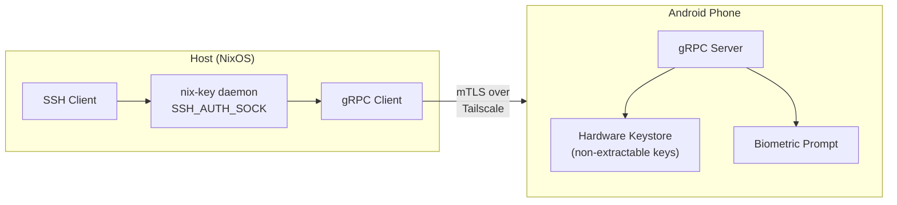

# nix-key

> SSH agent that delegates private key operations to your Android phone over Tailscale with mTLS. Keys never leave the phone's hardware keystore.

[](https://github.com/mmmaxwwwell/nix-key/actions/workflows/ci.yml)
[](https://github.com/mmmaxwwwell/nix-key/actions/workflows/e2e.yml)
[](https://github.com/mmmaxwwwell/nix-key/actions/workflows/release.yml)
[](LICENSE)
[](https://github.com/mmmaxwwwell/nix-key/releases)

## What is nix-key?

nix-key turns your Android phone into a hardware-backed SSH key. Instead of storing private keys on your laptop, they live in your phone's hardware keystore (Titan M2, StrongBox, TEE) where they are non-extractable. When an SSH client requests a signature, the host daemon asks your phone over an encrypted Tailscale tunnel, and you approve with your fingerprint.

**Why nix-key?**

- **Hardware-bound keys** -- Private keys are generated inside the phone's secure element and cannot be exported, even by root.
- **Biometric approval** -- Every sign request requires explicit fingerprint/face confirmation on your phone.
- **Zero-trust networking** -- Communication uses mTLS over Tailscale with certificate pinning. No ports exposed to the internet.
- **NixOS-native** -- Declarative NixOS module with systemd integration, age-encrypted secrets at rest, and reproducible builds.

## Architecture



**Wire protocol**: gRPC over mTLS with certificate pinning. Protobuf service defined in `proto/nixkey/v1/`. OpenTelemetry W3C trace context propagated in gRPC metadata for distributed tracing.

**Pairing flow**: Host generates ephemeral HTTPS server and displays a QR code. Phone scans QR, mutual certificate exchange occurs, and age-encrypted certificates are stored on the host.

## Features

- Standard SSH agent protocol (`SSH_AUTH_SOCK` Unix socket)
- Hardware keystore keys (Android StrongBox / TEE) -- non-extractable
- Per-sign biometric confirmation on the phone
- mTLS with certificate pinning over Tailscale
- Age encryption for certificates at rest on the host
- QR-code pairing flow (no manual key exchange)
- Declarative NixOS module with systemd user service
- OpenTelemetry distributed tracing (optional Jaeger backend)
- CLI for device management, status, and diagnostics
- Multi-device support with per-device configuration
- Configurable sign and connection timeouts
- Unlock-to-use policies (per-key lock/unlock lifecycle)

## Getting Started

### Prerequisites

- **Host**: NixOS with flakes enabled
- **Phone**: Android 10+ with hardware keystore support
- **Network**: Both devices on the same [Tailscale](https://tailscale.com) tailnet

### Install via flake

Add nix-key to your NixOS flake:

```nix
# flake.nix
{
  inputs.nix-key.url = "github:mmmaxwwwell/nix-key";

  outputs = { nixpkgs, nix-key, ... }: {
    nixosConfigurations.myhost = nixpkgs.lib.nixosSystem {
      modules = [
        nix-key.nixosModules.default
        {
          services.nix-key = {
            enable = true;
            package = nix-key.packages.x86_64-linux.default;
            tracing.jaeger.package = nix-key.packages.x86_64-linux.jaeger;
          };
        }
      ];
    };
  };
}
```

### First run

```bash
# 1. Rebuild your NixOS configuration
sudo nixos-rebuild switch

# 2. The systemd user service starts automatically.
#    Check status:
nix-key status

# 3. Pair your phone (displays a QR code in the terminal):
nix-key pair

# 4. Scan the QR code with the nix-key Android app.
#    After pairing completes:
nix-key devices

# 5. Export a public key to add to your servers:
nix-key export <key-id> >> ~/.ssh/authorized_keys

# 6. SSH_AUTH_SOCK is set automatically via environment.d.
#    Test it:
ssh-add -l
ssh user@server
```

## Configuration

All options live under `services.nix-key` in your NixOS configuration.

| Key | Type | Default | Required | Sensitive | Description |
|-----|------|---------|----------|-----------|-------------|
| `enable` | `bool` | `false` | yes | no | Enable the nix-key SSH agent service. |
| `package` | `package` | -- | yes | no | The nix-key package to use. |
| `port` | `port` | `29418` | no | no | Default port for phone gRPC connections. Can be overridden per device. |
| `tailscaleInterface` | `str` | `"tailscale0"` | no | no | Network interface name for Tailscale. |
| `allowKeyListing` | `bool` | `true` | no | no | Whether to allow listing SSH keys from paired phones. |
| `signTimeout` | `int` | `30` | no | no | Seconds to wait for sign request approval. |
| `connectionTimeout` | `int` | `10` | no | no | Seconds to wait for mTLS connection to a phone. |
| `socketPath` | `str` | `""` | no | no | SSH agent socket path. Empty uses `$XDG_RUNTIME_DIR/nix-key/agent.sock`. |
| `controlSocketPath` | `str` | `""` | no | no | Control socket path. Empty uses `$XDG_RUNTIME_DIR/nix-key/control.sock`. |
| `logLevel` | `enum` | `"info"` | no | no | Minimum log level: `debug`, `info`, `warn`, `error`, `fatal`. |
| `certExpiry` | `str` | `"365d"` | no | no | Expiry duration for generated mTLS certificates (e.g. `"90d"`). |
| `tracing.otelEndpoint` | `str?` | `null` | no | no | OTLP collector endpoint (e.g. `"localhost:4317"`). Null disables tracing. |
| `tracing.jaeger.enable` | `bool` | `false` | no | no | Run a local Jaeger instance and export traces to it. |
| `tracing.jaeger.package` | `package` | -- | if jaeger enabled | no | The Jaeger package to use. |
| `secrets.ageKeyFile` | `str` | `"~/.local/state/nix-key/age-identity.txt"` | no | **yes** | Path to the age identity file for decrypting mTLS private keys. |
| `tailscale.authKeyFile` | `str?` | `null` | no | **yes** | Path to a file containing a Tailscale pre-auth key. |
| `devices` | `attrsOf submodule` | `{}` | no | no | Declarative device definitions (merged with runtime-paired devices). |
| `devices.<name>.name` | `str` | -- | yes | no | Display name of the paired phone. |
| `devices.<name>.tailscaleIp` | `str` | -- | yes | no | Tailscale IP address of the phone. |
| `devices.<name>.port` | `port` | `29418` | no | no | Port the phone's gRPC server listens on. |
| `devices.<name>.certFingerprint` | `str` | -- | yes | **yes** | SHA256 fingerprint of the phone's TLS certificate. |
| `devices.<name>.clientCert` | `path?` | `null` | no | no | Path to client certificate PEM for mTLS. |
| `devices.<name>.clientKey` | `path?` | `null` | no | **yes** | Path to client private key PEM (age-encrypted). |

## Usage

### CLI subcommands

```bash
# Run the SSH agent daemon (normally managed by systemd)
nix-key daemon

# Pair with a new phone -- displays QR code in terminal
nix-key pair

# List all paired devices
nix-key devices

# Revoke a paired device
nix-key revoke pixel-8

# Show daemon status (connected devices, socket path, uptime)
nix-key status

# Export an SSH public key in authorized_keys format
nix-key export ed25519-abcd1234

# Show current configuration
nix-key config

# Tail daemon logs (human-readable format)
nix-key logs

# Test connectivity to a paired device
nix-key test pixel-8
```

### Using with SSH

Once paired, nix-key works transparently with any SSH client:

```bash
# List available keys (fetched from your phone)
ssh-add -l

# SSH to a server -- sign request appears on your phone
ssh user@server

# Git over SSH -- same biometric approval
git push origin main
```

## Development

### Enter the dev shell

```bash
nix develop    # provides Go, protoc, golangci-lint, age, headscale, etc.
```

### Build and test

```bash
make build              # build the nix-key binary
make test               # run unit + integration tests (structured output)
make test-unit          # unit tests only (-short)
make test-integration   # integration tests only (TestIntegration*)
make lint               # golangci-lint
make bench              # run benchmarks (mTLS handshake, signing)
make cover              # HTML coverage report -> coverage/index.html
make proto              # regenerate Go code from protobuf
make security-scan      # run local security scanners
make validate           # test + lint + security-scan
nix flake check         # full suite including NixOS VM tests
```

### Project structure

```
cmd/nix-key/            CLI entrypoint (cobra subcommands)
cmd/test-reporter/      Structured test reporter (go test -json -> JSON)
internal/
  agent/                SSH agent protocol handler (Unix socket)
  config/               Configuration loading and defaults
  daemon/               Device registry, shutdown, control socket
  errors/               Project error hierarchy
  logging/              Structured JSON logger (wraps slog)
  mtls/                 mTLS certificate management + age encryption
  pairing/              QR code generation, HTTPS pairing server
  tracing/              OpenTelemetry tracing initialization
pkg/phoneserver/        gRPC server for phone side (shared via gomobile)
gen/nixkey/v1/          Generated Go code from protobuf
proto/nixkey/v1/        Protobuf service definitions (.proto)
test/
  fixtures/             Deterministic test certs/keys (fixed seeds)
  phonesim/             Phone simulator for VM tests
  e2e/                  End-to-end test helpers
nix/
  module.nix            NixOS module (systemd service, config)
  package.nix           Nix package for nix-key binary
  tests/                NixOS VM integration tests
android/                Android app (Kotlin, Compose, Hilt)
```

## CI Setup

### Required GitHub secrets

The CI pipeline uses three optional secrets for enhanced scanning. CI runs without them (Tier 1 scanners always run), but adding them enables Tier 1.5 scanners.

| Secret | Used by | How to obtain |
|--------|---------|---------------|
| `SNYK_TOKEN` | Snyk vulnerability scanning | Sign up at [snyk.io](https://snyk.io), go to Account Settings > API Token |
| `SONAR_TOKEN` | SonarCloud code analysis | Sign up at [sonarcloud.io](https://sonarcloud.io), go to My Account > Security > Generate Token |
| `CACHIX_AUTH_TOKEN` | Nix binary cache | Sign up at [cachix.org](https://cachix.org), create a cache named `nix-key`, generate an auth token |

Add each secret in your GitHub repository under Settings > Secrets and variables > Actions > New repository secret.

### CI pipeline overview

- **Lint**: golangci-lint, nixfmt, ktlint, RacerD
- **Test Host**: Go unit/integration tests with `-race`, benchmarks, NixOS VM tests
- **Test Android**: Gradle build + unit tests
- **Security**: Trivy, Semgrep, Gitleaks, govulncheck (Tier 1); Snyk, SonarCloud, OpenSSF Scorecard (Tier 1.5)
- **Fuzz**: Time-boxed generative fuzzing (60s per target)
- **E2E**: Android emulator end-to-end tests (triggered on push to develop/main)

## Security

### Threat model

nix-key assumes the host machine may be compromised. Private keys are stored exclusively in the phone's hardware keystore and cannot be extracted even with root access to the phone. The host never sees private key material -- it only receives signatures.

### Key protections

- **Non-extractable keys**: Generated inside the phone's secure element (StrongBox/TEE). The `setIsStrongBoxBacked(true)` and `setUserAuthenticationRequired(true)` flags ensure keys cannot be exported and require biometric confirmation for every use.
- **Certificate pinning**: The host stores the SHA256 fingerprint of each phone's TLS certificate at pairing time. Every subsequent connection verifies the certificate matches the pinned fingerprint, preventing MITM attacks even if Tailscale's control plane is compromised.
- **mTLS**: Both sides authenticate with certificates. The host presents a client certificate; the phone presents a server certificate. Connections without valid mutual certificates are rejected.
- **Age encryption at rest**: mTLS private keys stored on the host are encrypted with [age](https://age-encryption.org). The age identity file is the only secret on disk.
- **No secrets in SSH errors**: The SSH agent returns `SSH_AGENT_FAILURE` without internal details to prevent information leakage to SSH clients.
- **File permissions**: Secrets use `0600`, secret directories use `0700`.

### Attack scenarios mitigated

| Scenario | Mitigation |
|----------|------------|
| Host compromise | Attacker has no private key -- can only request signatures, which require biometric approval on the phone |
| Network MITM | mTLS + certificate pinning; Tailscale WireGuard encryption as outer layer |
| Rogue phone on tailnet | Certificate pinning rejects connections from unpinned certificates |
| Stolen phone | Keys require biometric authentication; hardware keystore wipes after failed attempts |
| Disk forensics on host | mTLS keys encrypted with age; no plaintext secrets on disk |

## License

See [LICENSE](LICENSE) for details.
