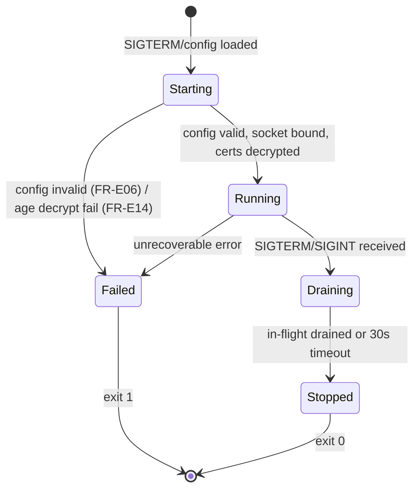
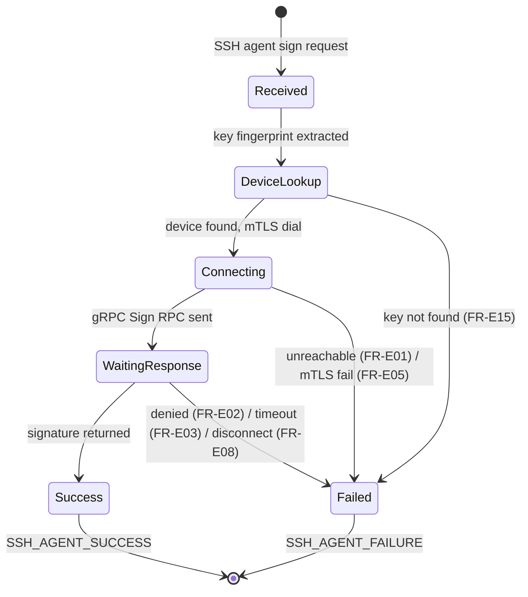
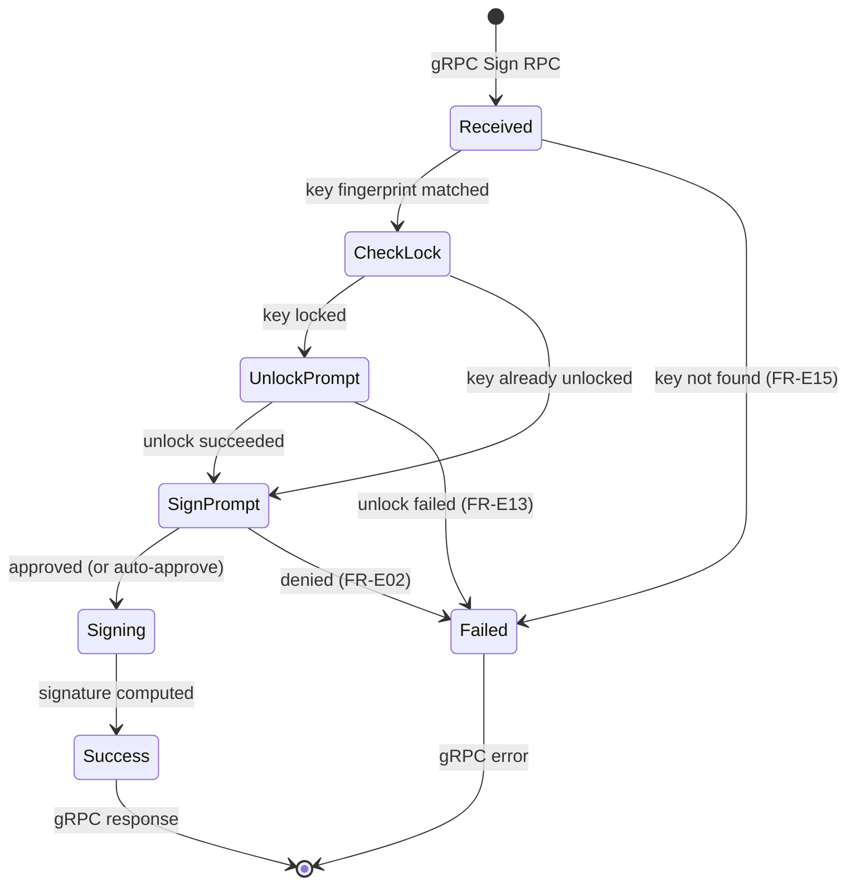
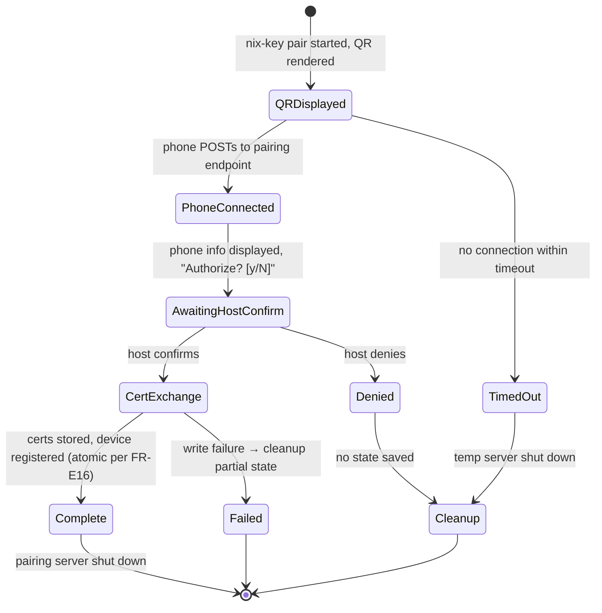
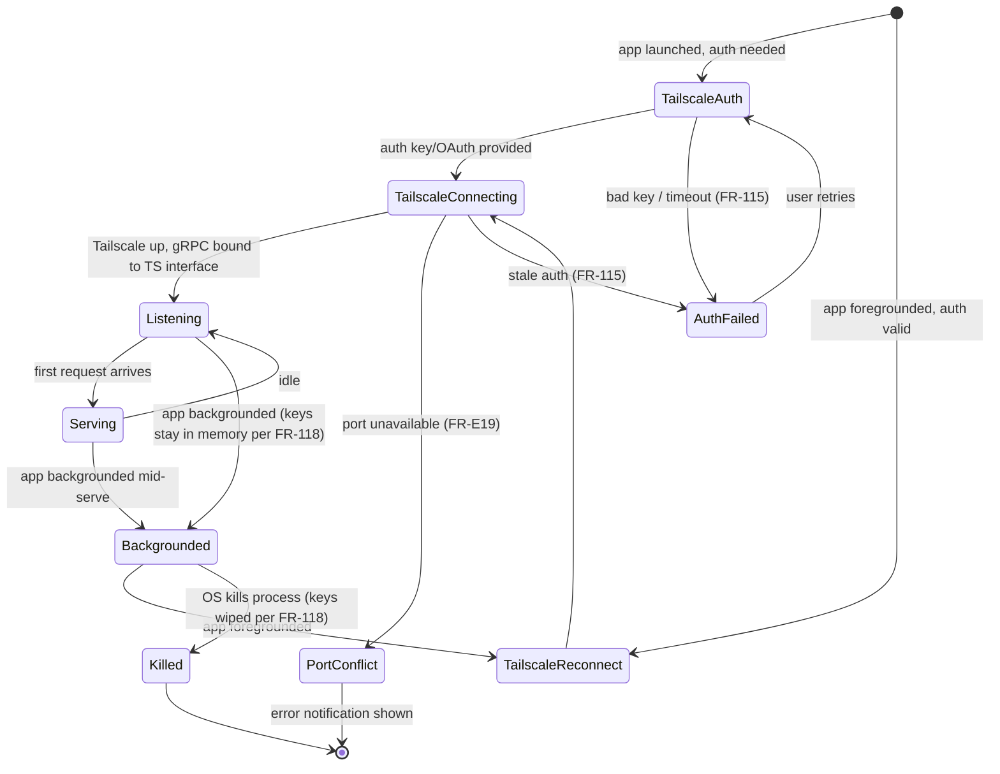
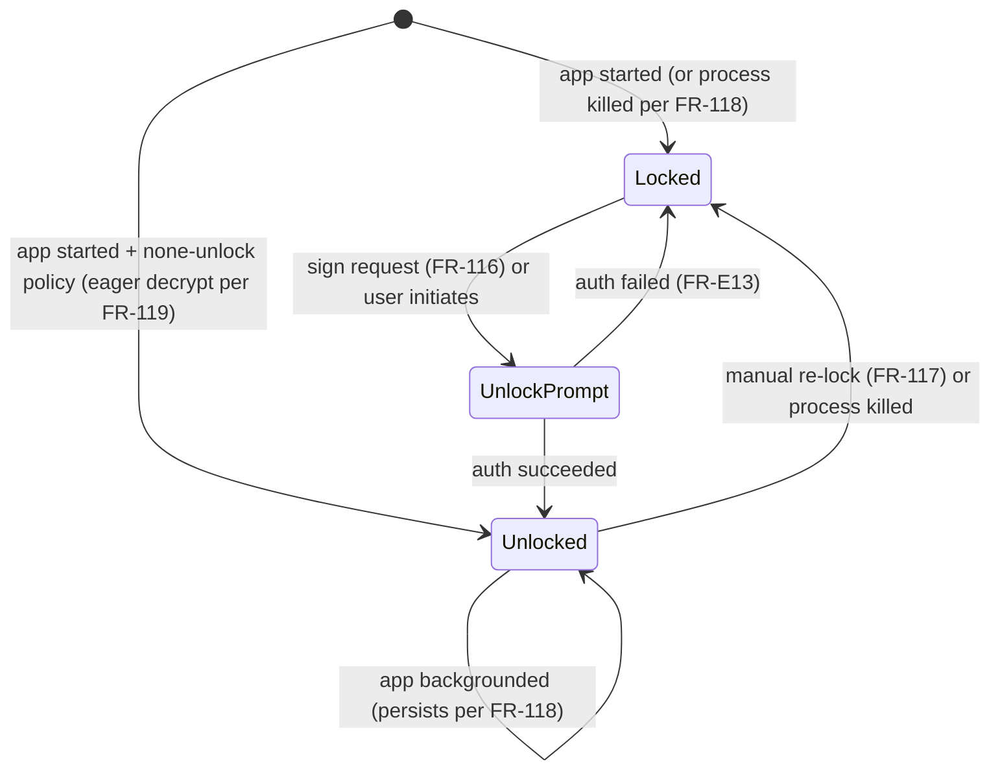

# Implementation Plan: nix-key

**Date**: 2026-03-28 | **Spec**: `specs/nix-key/spec.md`
**Preset**: public

## Summary

nix-key is a phone-as-YubiKey SSH agent. An Android app stores SSH keys in hardware-backed Keystore and signs requests on behalf of a NixOS host daemon. Communication uses gRPC over mTLS over Tailscale. The host side is a single Go binary (daemon + CLI) distributed as a NixOS module (`services.nix-key`). Device pairing uses QR codes with cert exchange. Integration tests use headscale in NixOS VM tests.

## Technical Context

**Language/Version**: Go 1.22+ (host), Kotlin 2.0+ (Android)
**Primary Dependencies**: `golang.org/x/crypto/ssh/agent`, `google.golang.org/grpc`, `filippo.io/age`, `libtailscale` (gomobile), gRPC-Kotlin, Jetpack Compose, BouncyCastle
**Storage**: JSON files (host config/devices), Android Keystore + EncryptedSharedPreferences (phone)
**Testing**: Go `testing` (host), JUnit/Espresso (Android), NixOS `nixosTest` (VM tests), headscale (E2E Tailnet)
**Target Platform**: NixOS (host), Android 10+ API 29+ (phone)
**Project Type**: daemon + CLI + mobile app + NixOS module
**Performance Goals**: Sign request round-trip < 2 seconds (including user prompt display)
**Constraints**: mTLS required on all connections, private keys never leave phone, certs encrypted at rest with age
**Scale/Scope**: Single user, 1-5 paired phones, ~10 SSH keys total

## Constitution Check

| Principle | Status | Notes |
|-----------|--------|-------|
| I. Nix-First | PASS | Everything Nix-built, flake exports module/package/checks |
| II. Security by Default | PASS | mTLS, cert pinning, age encryption at rest, Keystore |
| III. Test-First | PASS | TDD, NixOS VM tests, Android instrumented tests, headscale E2E |
| IV. Unix Philosophy | PASS | systemd user service, XDG dirs, SSH_AUTH_SOCK |
| V. Minimal Trust Surface | PASS | App-only Tailnet, per-key confirmation, mutual pairing auth |
| VI. Simplicity | PASS | Single binary, single config format, one screen per concern |

## Project Structure

### Documentation

```
specs/nix-key/
├── spec.md
├── plan.md              # This file
├── research.md          # Architecture decisions & rationale
├── data-model.md        # Entity definitions, state machines
├── UI_FLOW.md           # Android app screens, navigation, validation
├── interview-notes.md   # Key decisions from interview
└── tasks.md             # Generated by /speckit.tasks
```

### Source Code

```
nix-key/
├── proto/
│   └── nixkey/v1/
│       └── nix_key.proto           # gRPC service definition
├── cmd/
│   └── nix-key/
│       └── main.go                 # Single binary entry point
├── internal/
│   ├── agent/
│   │   ├── agent.go                # SSH agent protocol handler
│   │   └── agent_test.go
│   ├── daemon/
│   │   ├── daemon.go               # Main loop, device registry
│   │   ├── control.go              # Control socket (CLI↔daemon)
│   │   └── daemon_test.go
│   ├── config/
│   │   ├── config.go               # Config loading, validation
│   │   ├── schema.go               # JSON schema for config
│   │   └── config_test.go
│   ├── mtls/
│   │   ├── certs.go                # Cert generation, pinning
│   │   ├── age.go                  # Age encrypt/decrypt
│   │   └── mtls_test.go
│   ├── pairing/
│   │   ├── server.go               # Temporary HTTPS pairing server
│   │   ├── qr.go                   # QR code generation
│   │   └── pairing_test.go
│   ├── cli/
│   │   ├── pair.go                 # nix-key pair
│   │   ├── devices.go              # nix-key devices/revoke
│   │   ├── status.go               # nix-key status
│   │   ├── export.go               # nix-key export
│   │   ├── config_cmd.go           # nix-key config
│   │   ├── logs.go                 # nix-key logs
│   │   └── test_cmd.go             # nix-key test
│   ├── logging/
│   │   ├── logger.go               # Structured JSON logger (slog wrapper)
│   │   └── logger_test.go
│   └── errors/
│       ├── errors.go               # Error hierarchy
│       └── errors_test.go
├── pkg/
│   └── phoneserver/
│       ├── server.go               # gRPC server (ListKeys, Sign, Ping)
│       ├── keystore.go             # Key storage interface
│       ├── confirm.go              # Confirmation interface
│       └── server_test.go
├── test/
│   ├── e2e/                        # Go helpers for NixOS VM tests
│   ├── phonesim/
│   │   └── main.go                 # Simulated phone (uses pkg/phoneserver)
│   └── fixtures/
│       ├── certs/                  # Test certificates
│       └── keys/                   # Test SSH keys
├── android/
│   ├── app/
│   │   └── src/
│   │       ├── main/java/com/nixkey/
│   │       │   ├── MainActivity.kt
│   │       │   ├── NixKeyApp.kt           # Application class, Hilt
│   │       │   ├── ui/
│   │       │   │   ├── navigation/NavGraph.kt
│   │       │   │   ├── servers/ServerListScreen.kt
│   │       │   │   ├── pairing/PairingScreen.kt
│   │       │   │   ├── keys/KeyListScreen.kt
│   │       │   │   ├── keys/KeyDetailScreen.kt
│   │       │   │   ├── signing/SignRequestDialog.kt
│   │       │   │   ├── settings/SettingsScreen.kt
│   │       │   │   └── auth/TailscaleAuthScreen.kt
│   │       │   ├── bridge/
│   │       │   │   └── GoPhoneServer.kt   # gomobile bridge to pkg/phoneserver
│   │       │   ├── keystore/
│   │       │   │   ├── KeyManager.kt      # Android Keystore operations
│   │       │   │   └── Ed25519Wrapper.kt  # BC Ed25519 + AES wrapping
│   │       │   ├── biometric/
│   │       │   │   └── BiometricHelper.kt # BiometricPrompt wrapper
│   │       │   ├── tailscale/
│   │       │   │   └── TailscaleManager.kt # libtailscale wrapper
│   │       │   ├── service/
│   │       │   │   └── GrpcServerService.kt # Foreground service for gRPC
│   │       │   └── data/
│   │       │       ├── HostRepository.kt
│   │       │       └── KeyRepository.kt
│   │       ├── androidTest/               # Instrumented tests
│   │       └── test/                      # Unit tests
│   ├── build.gradle.kts
│   └── settings.gradle.kts
├── nix/
│   ├── module.nix                  # NixOS module (services.nix-key)
│   ├── package.nix                 # Go binary derivation
│   ├── phonesim.nix                # Phone simulator derivation
│   ├── android-apk.nix             # Android APK build
│   ├── android-emulator.nix        # Android emulator for CI E2E
│   ├── jaeger.nix                  # Jaeger v2 package (GitHub releases)
│   ├── infer.nix                   # Facebook Infer (Android static analysis)
│   └── tests/
│       ├── service-test.nix        # Service lifecycle, config, SSH_AUTH_SOCK
│       ├── pairing-test.nix        # Pairing over headscale
│       └── signing-test.nix        # Signing over headscale
├── flake.nix
├── flake.lock
├── Makefile
├── .envrc
├── .gitignore
├── CLAUDE.md
└── .github/
    └── workflows/
        ├── ci.yml                  # lint + test-host + test-android + security
        ├── e2e.yml                 # Android emulator E2E (KVM)
        ├── fuzz.yml                # Generative fuzzing on develop push
        └── release.yml             # Build + tag + SBOM (on push to main)
```

## Interface Contracts (Internal)

| IC | Name | Producer | Consumer(s) | Specification |
|----|------|----------|-------------|---------------|
| IC-001 | Config file | NixOS module (T040) | Daemon, CLI, tests (T009, T021, T054-T061) | `~/.config/nix-key/config.json`, JSON schema per FR-098/FR-100, 0644 |
| IC-002 | Device registry | Pairing (T025), NixOS module (T039) | Daemon (T020), CLI (T054-T055) | `~/.local/state/nix-key/devices.json`, JSON, 0600. Merge semantics: Nix wins on conflict (FR-064) |
| IC-003 | Cert store | Pairing (T025) | Daemon mTLS (T018, T021) | `~/.local/state/nix-key/certs/`, PEM age-encrypted per FR-101/FR-104, 0600 |
| IC-004 | Agent socket | Daemon (T019) | SSH clients, tests | `$XDG_RUNTIME_DIR/nix-key/agent.sock` per FR-002, SSH agent protocol (list keys + sign) |
| IC-005 | Control socket | Daemon (T026) | CLI commands (T054-T061) | Unix socket at `controlSocketPath`, line-delimited JSON per FR-078/FR-079 |
| IC-006 | environment.d conf | NixOS module (T040) | Login sessions | `~/.config/environment.d/50-nix-key.conf` containing `SSH_AUTH_SOCK=<socketPath>` per FR-069a |
| IC-007 | QR payload format | `nix-key pair` (T023) | Android app (T036) | Base64 JSON `{v:1, host, port, cert, token, otel?}` per FR-021 |
| IC-008 | gRPC wire protocol | Proto schema (T012) | Host client (T021), phone server (T013) | `proto/nixkey/v1/nix_key.proto`, ListKeys/Sign/Ping per FR-017 |
| IC-009 | Structured log format | Daemon logger (T007) | `nix-key logs` (T059) | JSON per line: timestamp, level, message, module, correlationId per FR-090 |
| IC-010 | Age identity | First run/pairing (T017, T025) | Daemon startup (T018) | `~/.local/state/nix-key/age.key`, age identity format, 0600, skip-if-exists |

## Runtime State Machines

### Daemon Lifecycle



### Sign Request Flow (Host)



### Sign Request Flow (Phone)



Note: If unlock fails and more requests are queued, the next request triggers its own unlock prompt (FR-053).

### Pairing Session



### Phone gRPC Server Lifecycle



### Key Unlock Lifecycle (Phone, per-key)



## Test Plan Matrix

| SC | Test Tier | Fixture Requirements | Assertion | Infrastructure |
|----|-----------|---------------------|-----------|----------------|
| SC-001 | Integration (user-flow) | In-process gRPC phone server, test keys, test certs | `ssh-add -L` returns keys, sign succeeds, unlock→sign flow works | Unix socket, mTLS |
| SC-002 | Integration (user-flow) | Simulated phone HTTP client, test certs | Device in registry, certs age-encrypted, two cert pairs generated | Pairing server |
| SC-003 | Android instrumented | Android Keystore (emulator) | SSH format output, non-extractability, both key types | Emulator |
| SC-004 | NixOS VM | Test NixOS config | Service active, config.json correct, SSH_AUTH_SOCK via environment.d | NixOS VM |
| SC-005 | Integration | Running daemon, test fixtures | CLI output correct, control socket JSON protocol works | Control socket |
| SC-006 | Integration | Phone server with deny/timeout/disconnect modes | SSH_AGENT_FAILURE for each failure mode | Unix socket |
| SC-007 | Integration (adversarial) + NixOS VM | Expired/wrong-CA/unpinned/rogue certs | mTLS handshake rejected, no detail leakage | mTLS, NixOS VM with rogue node |
| SC-008 | NixOS VM | OTEL collector, headscale | Trace spans with correct parent-child, zero overhead when disabled | Jaeger/collector |
| SC-009 | CI | N/A | Zero critical findings in all scanners | CI pipeline |
| SC-010 | NixOS VM | Test NixOS config with devices | Service starts, devices merged, log level config, declarative certs, environment.d | NixOS VM |
| SC-011 | NixOS VM (adversarial) | Adversarial cert fixtures, firewall | All 6 adversarial scenarios rejected | NixOS VM with rogue node |
| SC-012 | Go fuzz | Seed corpus from test fixtures | No crashes, round-trip properties hold | None |
| SC-013 | Integration | In-process phone server, auto-approve | p95 < 2s over 20 runs | Unix socket, mTLS |
| SC-014 | Android instrumented (UI) | Emulator | Correct indicator states, loading states, no premature "ready" | Emulator |
| SC-015 | Android instrumented | QR code bitmap fixture | ML Kit decodes correct payload | Emulator |
| SC-016 | Manual + CI | N/A | README sections present, commands work, badges render | N/A |
| SC-017 | Manual | N/A | LICENSE file present, compatible with deps | N/A |
| SC-018 | Integration + NixOS VM | Running daemon, test requests | JSON log output, correct levels, correlation IDs, security events at INFO+ | Unix socket |
| SC-019 | Integration | Error-triggering scenarios | Typed errors with codes/correlation IDs, sanitized SSH responses | Unix socket |
| SC-020 | Integration + NixOS VM | Age identity, test certs | Keys encrypted on disk, decrypted in memory only, ageKeyFile works | Age identity |
| SC-021 | Integration + NixOS VM | Empty state dirs, existing state | Dirs created with 0700, warm start reuses state, pair is idempotent | Filesystem |
| SC-022 | Integration | Working project | All Makefile targets exit 0, produce expected output | Nix devshell |
| SC-023 | CI | N/A | test-android and test-host fail when 0 tests reported | GitHub Actions |
| SC-024 | CI | N/A | debug-apk and nix-key-binary artifacts uploaded on develop | GitHub Actions |
| SC-025 | Post-merge | N/A | All 5 README badges render valid status | curl + SVG parsing |

## Critical Path (User Perspective)

**Day-1 user flow (walking skeleton):**
Install flake → enable service → rebuild → `nix-key pair` → scan QR on phone → approve → `ssh-add -L` → SSH sign succeeds

**Phase mapping:**
1. Phase 1 (flake + dev env)
2. Phase 2 (config, logging, errors — daemon can start)
3. Phase 4 (mTLS + age — certs work)
4. Phase 5 (SSH agent — socket accepts connections, forwards to phone)
5. Phase 6 (pairing — QR + cert exchange)
6. Phase 9 (NixOS module — declarative config, systemd service)
7. Phase 10 (E2E — full flow over headscale)

**Incremental integration checkpoints:**
- Phase 2 done: daemon starts with config, structured logs appear, graceful shutdown works
- Phase 5 done: `SSH_AUTH_SOCK` works, `ssh-add -L` returns keys from in-process mock phone
- Phase 6 done: `nix-key pair` completes with simulated phone, device in registry
- Phase 9 done: NixOS module produces working service, config.json generated, SSH_AUTH_SOCK set via environment.d
- Phase 10 done: full signing and pairing over real Tailscale (headscale) in NixOS VM

**First testable user result:** Phase 5 — `ssh-add -L` returns keys from a simulated phone.

## Performance Budget Decomposition

| Component | Sub-budget | Benchmark | CI behavior |
|-----------|-----------|-----------|-------------|
| mTLS handshake | < 200ms | `BenchmarkMTLSHandshake` | > 300% regression → fail |
| gRPC round-trip overhead | < 100ms | `BenchmarkGRPCRoundTrip` | > 300% regression → fail |
| Age decrypt (startup, not per-request) | < 50ms | `BenchmarkAgeDecrypt` | > 300% regression → fail |
| Phone signing (including unlock + prompt) | < 1500ms | E2E latency test | p95 > 2s → fail |
| Margin | 150ms | — | — |

## CI Hardening & Observable Output Validation (Phase 18-19)

### Problem Statement

The CI pipeline has a class of silent failures where jobs exit green despite producing no results:
- **test-android**: Gradle exit codes swallowed by pipe-to-tee (`cmd | tee log.txt` succeeds if `tee` succeeds). Job reports 0 passed / 0 failed as success.
- **Default branch gap**: `main` contains only `.claude/`, `.specify/`, `.gitignore` — no source code, workflows, or LICENSE. This causes: workflow badges 404, license badge "not specified", E2E badge failing (GitHub uses main's stale `e2e.yml` for `workflow_run` triggers), release automation broken.

### Architecture

All changes are in `.github/workflows/ci.yml` (additive steps within existing jobs):

**test-android job**:
1. Add `set -o pipefail` before Gradle commands
2. Add "Verify tests ran" step (`if: always()`) — count JUnit XML files, extract test count, exit 1 if 0
3. Add "Upload debug APK" step — `actions/upload-artifact@v4` with `debug-apk` name

**test-host job**:
1. Add "Verify tests ran" step (`if: always()`) — check `summary.json` exists, assert `passed + failed > 0`
2. Add "Upload Go binary" step — `nix build` + `actions/upload-artifact@v4` with `nix-key-binary` name

**security job**:
1. Add "Verify scanners ran" step (`if: always()`) — check each scanner's JSON output exists and >10 bytes, advisory `::warning::` (not hard failure)

**Post-CI observable output validation**:
1. Verify artifacts uploaded via `gh run view --json artifacts`
2. Verify default branch readiness before PR to main (workflows, LICENSE, README, release config)
3. Verify `workflow_run` triggers reference workflows that exist on the default branch
4. Fetch all README badge URLs, verify HTTP 200 and valid SVG content post-merge

### Test Plan

SC-023 through SC-025 are included in the main Test Plan Matrix above.

## Complexity Tracking

| Violation | Why Needed | Simpler Alternative Rejected Because |
|-----------|------------|-------------------------------------|
| `KeyStore` interface in `pkg/phoneserver` (2 implementations: Android + test) | Test simulator needs in-memory keys; Android uses Keystore | Direct Keystore calls would make the server untestable outside Android |
| `Confirmer` interface in `pkg/phoneserver` (2 implementations: BiometricPrompt + auto-approve) | Tests can't trigger biometric prompts | Hardcoded confirmation would require Android emulator for all tests |
| gomobile bridge layer | Go code needs to be callable from Kotlin | Direct JNI is more complex; gomobile is the standard approach |
| Age encryption for certs at rest | Constitution II mandates encrypted secrets | Plaintext with 0600 permissions would be simpler but violates constitution |
| Two-policy model (unlock + signing) per key | User requires YubiKey-like unlock semantics with independent per-request auth | Single "confirmation policy" conflates decrypt-into-memory with per-request approval |
| Infer/RacerD in CI for Android | User mandates validated concurrency safety | Annotations alone are unchecked; runtime race detection doesn't exist for Kotlin coroutines |

## Phase Dependencies

```
Phase 1 (Test Infra + Flake) ──▶ Phase 2 (Foundation: logging, errors, config, CI)
                              ──▶ Phase 3 (Protobuf + gRPC) ──▶ Phase 4 (mTLS + Age)
                                                               ──▶ Phase 5 (SSH Agent)
                                                               ──▶ Phase 6 (Pairing)
Phase 1 ──▶ Phase 7 (Android Core: Keystore, UI scaffold)     ──▶ Phase 8 (Android gRPC + Tailscale)
Phase 5 + Phase 6 ──▶ Phase 9 (NixOS Module)
Phase 8 + Phase 9 ──▶ Phase 10 (E2E: phonesim over headscale)
Phase 10 ──▶ Phase 11 (OTEL Distributed Tracing)
Phase 10 ──▶ Phase 12 (CLI Polish: all subcommands)
Phase 12 ──▶ Phase 13 (Android Emulator E2E)
Phase 13 ──▶ Phase 14 (CI/CD Pipeline + Release)
Post-impl ──▶ Phase 15 (Hardening: fuzz, bench, adversarial, security scan, DX)
Phase 15 ──▶ Phase 16 (Android Hardening: unlock lifecycle, UI status, loading states, RacerD)
Phase 15 + 16 ──▶ Phase 17 (Documentation: README, config table, coverage boundaries, license)
Phase 17 ──▶ Phase 18 (Final CI validation + PR)
```

### Parallel workstreams

```
Agent A (Host):    Phase 1 → 2 → 3 → 4 → 5 → 6 → 9 → 10 → 11 → 12 → 14 → 15a-d (host hardening)
Agent B (Android): Phase 1 (wait) → 7 → 8 → (wait for Phase 9) → 10 → 13 → 16 (Android hardening)
Agent C (Docs):    (wait for Phase 15+16) → 17 (README, config table, coverage doc, license)
```

Phases 3-6 (host protocol) and 7-8 (Android core) can run in parallel after Phase 2.
Phase 15 (host hardening) and Phase 16 (Android hardening) can run in parallel.
Sync points: Phase 10 (E2E requires both host and Android ready), Phase 14 (CI requires everything), Phase 17 (docs require all hardening done).

## Implementation Phases

### Phase 1: Test Infrastructure + Flake Setup
**Goal**: Working dev environment, test runner, structured test output.

**Tasks**:
- Create `flake.nix` with devShell: Go 1.22+, protoc, protoc-gen-go, protoc-gen-go-grpc, age, headscale, tailscale, golangci-lint, nixfmt
- Create `.envrc` with `use flake`
- Create `Makefile` with targets: `dev`, `test`, `test-unit`, `test-integration`, `lint`, `build`, `proto`, `clean`
- Set up Go module (`go.mod`)
- Create custom structured test reporter that outputs `test-logs/<type>/<timestamp>/summary.json` and `failures/<test-name>.log`
- Create test fixtures: self-signed CA, test certs, test SSH keypairs in `test/fixtures/`
- Configure code coverage: `go test -coverprofile=coverage.out ./...`
- Create `.gitignore` (already done, verify complete)
- Create initial `CLAUDE.md` with dev setup instructions

**Validates**: Dev environment works, `nix develop` enters shell, `make test` runs

### Phase 2: Foundational Infrastructure
**Goal**: Logging, error handling, config management ready before feature work.

**Tasks**:
- **Logging** (`internal/logging/`): Structured JSON logger wrapping `slog`. Fields: timestamp, level, message, module, correlationId. Configurable level via config. Output to stderr.
- **Error hierarchy** (`internal/errors/`): `NixKeyError` base with `ConnectionError`, `TimeoutError`, `CertError`, `ConfigError`, `ProtocolError`. Each has error code, message. `Is()` and `As()` support for Go error wrapping.
- **Config module** (`internal/config/`): Load from `~/.config/nix-key/config.json`, validate against JSON schema, fail-fast on invalid. Three layers: defaults → config file → env vars. Sensitive values (key paths) logged as "present"/"missing", never values.
- **Graceful shutdown**: Signal handler registry. SIGTERM/SIGINT → stop accepting connections → drain in-flight → close sockets → flush logs → exit. 30s timeout.
- **Gitleaks pre-commit hook**: Install via `flake.nix`, configure `.gitleaks.toml`

**Validates**: `make test` passes, logging produces valid JSON, config fails on bad input

### Phase 3: Protobuf + gRPC
**Goal**: Define and generate the wire protocol.

**Tasks**:
- Write `proto/nixkey/v1/nix_key.proto` with `NixKeyAgent` service (ListKeys, Sign, Ping)
- Generate Go code: `protoc-gen-go` + `protoc-gen-go-grpc`
- Add `make proto` target
- Write unit tests for protobuf serialization/deserialization
- Create `pkg/phoneserver/` with interfaces: `KeyStore` (ListKeys, Sign), `Confirmer` (RequestConfirmation)
- Implement gRPC server in `pkg/phoneserver/server.go` using the interfaces
- Write tests with mock `KeyStore` and auto-approve `Confirmer`

**Validates**: gRPC server starts, responds to ListKeys/Sign/Ping with mock data

### Phase 4: mTLS + Age Encryption
**Goal**: Certificate generation, pinning, and secret encryption.

**Tasks**:
- **Cert generation** (`internal/mtls/certs.go`): Generate self-signed X.509 certs (Ed25519 or ECDSA), configurable expiry
- **Cert pinning**: Verify peer cert against stored fingerprint, reject on mismatch
- **Age encryption** (`internal/mtls/age.go`): Encrypt/decrypt files using `filippo.io/age`. Generate age identity on first run. Encrypt private keys before writing, decrypt into memory on load.
- **mTLS dialer**: Go TLS client that connects to phone with client cert + pins phone's server cert
- Integration tests: generate certs, encrypt with age, decrypt, establish mTLS connection between two goroutines

**Validates**: mTLS handshake succeeds with pinned certs, age encrypt/decrypt round-trips

### Phase 5: SSH Agent Protocol
**Goal**: Working SSH agent that forwards sign requests.

**Tasks**:
- Implement SSH agent protocol handler (`internal/agent/`): `SSH2_AGENTC_REQUEST_IDENTITIES`, `SSH2_AGENTC_SIGN_REQUEST`
- Unix socket listener at configured `socketPath`
- Sign request forwarding: receive sign request → look up device by key fingerprint → connect to phone via mTLS gRPC → call `Sign` RPC → return signature
- List keys: connect to all reachable phones → collect keys → return combined list. Skip unreachable phones after `connectionTimeout`. Return empty if `allowKeyListing=false`.
- Timeout handling: `connectionTimeout` for phone reach, `signTimeout` for user response
- Integration tests with `pkg/phoneserver` running in-process as a simulated phone

**Validates**: `SSH_AUTH_SOCK` works, `ssh-add -L` lists keys, signing succeeds with simulated phone

### Phase 6: Pairing Flow
**Goal**: QR-code-based device pairing with cert exchange.

**Tasks**:
- **QR generation** (`internal/pairing/qr.go`): Encode pairing payload as Base64 JSON, render QR in terminal via `go-qrcode`
- **Temporary HTTPS server** (`internal/pairing/server.go`): Bind to Tailscale interface, serve pairing endpoint
- **Pairing protocol**: Accept phone POST with `{phoneName, tailscaleIp, listenPort, serverCert, token}`. Hold connection until CLI confirms. Respond with `{hostName, hostClientCert, status}`.
- **Token management**: Generate cryptographically random one-time token, invalidate after use
- **Device registration**: After successful pairing, encrypt phone's cert with age, store device info in `devices.json`, notify daemon via control socket
- **Control socket** (`internal/daemon/control.go`): Unix socket for CLI→daemon commands (register-device, list-devices, revoke, status)
- Integration tests: full pairing flow with simulated phone HTTP client

**Validates**: `nix-key pair` shows QR, simulated phone completes pairing, device appears in registry

### Phase 7: Android Core — Keystore + UI Scaffold
**Goal**: Android app skeleton with key management.

**Tasks**:
- Set up Android project: `android/` directory, Gradle with Kotlin DSL, Hilt DI, Compose Navigation
- **Key management** (`KeyManager.kt`):
  - ECDSA-P256: native Android Keystore generation with StrongBox when available
  - Ed25519: BouncyCastle generation + Keystore-backed AES wrapping key
  - List keys, export public key in SSH format, delete key
- **UI screens**: ServerListScreen, KeyListScreen, KeyDetailScreen, SettingsScreen (navigation only, no network yet)
- **Sign request dialog**: SignRequestDialog composable with approve/deny
- **BiometricHelper**: Wrap BiometricPrompt API, handle per-key confirmation policy
- **EncryptedSharedPreferences**: Set up for host info, key metadata, settings
- Android instrumented tests: key generation, export format, deletion, biometric mock

**Validates**: App builds, key creation/export works, UI navigates between screens

### Phase 8: Android gRPC Server + Tailscale
**Goal**: Phone acts as gRPC server over Tailscale.

**Tasks**:
- **gomobile bridge**: Build `pkg/phoneserver` as Android library via gomobile. Kotlin wrapper `GoPhoneServer.kt`.
- **libtailscale integration** (`TailscaleManager.kt`): Initialize userspace Tailscale, auth with key/OAuth, listen on Tailscale interface
- **Foreground service** (`GrpcServerService.kt`): Start gRPC server when app is foregrounded, stop when backgrounded. Notification shows "nix-key active".
- **Pairing screen**: QR scanner (ML Kit), pairing confirmation dialog, OTEL opt-in, cert storage
- **Wire up sign requests**: gRPC Sign RPC → show SignRequestDialog → biometric if needed → sign with Keystore → return signature
- **Tailscale auth screen**: First-launch flow for auth key or OAuth
- Android instrumented tests: gRPC server starts/stops, sign request flow with mock data

**Validates**: App runs gRPC server on Tailscale interface, simulated host can call Sign RPC

### Phase 9: NixOS Module
**Goal**: Declarative NixOS configuration for nix-key.

**Tasks**:
- **`nix/module.nix`**: Full options under `services.nix-key`:
  - `enable`, `port`, `tailscaleInterface`, `allowKeyListing`, `signTimeout`, `connectionTimeout`
  - `socketPath`, `logLevel`, `certExpiry` (default: null = no expiry)
  - `tracing.otelEndpoint`, `tracing.jaeger.enable`
  - `secrets.ageKeyFile`
  - `tailscale.authKeyFile`
  - `devices` attrset with per-device `name`, `tailscaleIp`, `port`, `certFingerprint`, `clientCert`, `clientKey`
- **systemd user service**: `nix-key-agent.service` running `nix-key daemon`
- **environment.d**: Create `~/.config/environment.d/50-nix-key.conf` with `SSH_AUTH_SOCK`
- **Config generation**: Write `~/.config/nix-key/config.json` from module options
- **Directory management**: Create `~/.config/nix-key/`, `~/.local/state/nix-key/certs/` with correct permissions
- **`nix/package.nix`**: `buildGoModule` derivation for `nix-key` binary
- **`flake.nix`** exports: `nixosModules.default`, `packages.default`, `checks`, `overlays.default`
- **Non-flake support**: Ensure `default.nix` or export structure works with `fetchTarball`
- NixOS VM tests (`nix/tests/service-test.nix`): module evaluation, service starts, config file written, SSH_AUTH_SOCK set

**Validates**: `nix flake check` passes, service starts in VM test, config.json generated correctly

### Phase 10: End-to-End Tests with Headscale
**Goal**: Full signing and pairing flow over real Tailscale networking.

**Tasks**:
- **`nix/phonesim.nix`**: Package the phone simulator (`test/phonesim/`) as a Nix derivation
- **`nix/tests/pairing-test.nix`**: NixOS VM test:
  - Start headscale, create users, generate pre-auth keys
  - Start host tailscale node, join headscale
  - Start phonesim tailscale node, join headscale
  - Run `nix-key pair` with auto-confirm, phonesim connects and completes pairing
  - Verify device appears in registry
- **`nix/tests/signing-test.nix`**: NixOS VM test:
  - Same headscale setup + pre-paired phonesim
  - Run `ssh-add -L` → verify keys listed
  - Run SSH sign operation → phonesim auto-approves → verify success
  - Test timeout behavior (phonesim delays response beyond signTimeout)
  - Test denial behavior (phonesim denies request)
- **`test/phonesim/main.go`**: Full phone simulator using `pkg/phoneserver` + `tsnet` (Go Tailscale library) + in-memory keys + auto-approve confirmer

**Validates**: Full pairing + signing works over real Tailscale network in NixOS VM

### Phase 11: OpenTelemetry Distributed Tracing
**Goal**: Traces span host↔phone across mTLS.

**Tasks**:
- **Host OTEL** (`internal/daemon/`): Initialize OpenTelemetry tracer provider, OTLP exporter. Create spans: `ssh-sign-request`, `device-lookup`, `mtls-connect`, `return-signature`. Inject traceparent into gRPC metadata.
- **Phone OTEL** (`pkg/phoneserver/`): Extract traceparent from gRPC metadata. Create child spans: `handle-sign-request`, `show-prompt`, `user-response`, `keystore-sign`. OTLP export.
- **Jaeger NixOS option**: `services.nix-key.tracing.jaeger.enable` adds Jaeger service
- **Pairing OTEL transfer**: Include `otelEndpoint` in QR payload when configured. Phone prompts to accept.
- **No-op when disabled**: Tracing disabled by default. Zero overhead (no-op tracer) when off.
- Integration test: perform signing with OTEL configured, verify trace appears in mock collector with correct span hierarchy

**Validates**: Traces visible in collector, spans correctly parented across mTLS boundary

### Phase 12: CLI Polish
**Goal**: All CLI subcommands working and tested.

**Tasks**:
- `nix-key devices` — list from daemon via control socket, formatted table output
- `nix-key revoke <device>` — send revoke to daemon, confirm deletion
- `nix-key status` — daemon status, connected devices, available keys, socket path, cert expiry warnings
- `nix-key export <key-id>` — get key from daemon, print SSH format to stdout
- `nix-key config` — read and display config.json
- `nix-key logs` — tail systemd journal for nix-key-agent, parse JSON, human-readable format
- `nix-key test <device>` — mTLS handshake + Ping RPC to specified device, report latency
- Integration tests for each command against running daemon

**Validates**: All CLI commands produce correct output, integration tests pass

### Phase 13: Android Emulator E2E
**Goal**: Real Android app tested over Tailnet. Decomposed into harness tasks + test.

**Sub-phases** (13a-13e; 13a-13d are parallel, 13e depends on all):

- **13a: APK Build** — Nix expression or documented Gradle step to build release APK with gomobile AAR. Verified installable via `adb install`.
- **13b: Emulator Nix Infrastructure** — `nix/android-emulator.nix` using `androidenv`: API 34 x86_64 system image, swiftshader GPU (headless), KVM acceleration, 120s boot timeout with retry. Helper script `start-emulator.sh`.
- **13c: Test-Mode Deep Link** — `nix-key://pair?payload=<base64>` intent handler in Android app (debug builds only). Bypasses ML Kit camera scanner — critical because camera input injection in emulators is unreliable.
- **13d: UI Automator Helper Library** — `NixKeyE2EHelper.kt` with reusable methods: `createKey()`, `pairWithHost()`, `approveSignRequest()`, `denySignRequest()`, `enterTailscaleAuthKey()`, `waitForElement()`. Each method includes retry logic (3 attempts). Self-tested against local emulator.
- **13e: E2E Test** — `test/e2e/android_e2e_test.sh` shell orchestrator. **Side-by-side architecture** (NOT nested): Android emulator and host services run directly on the CI runner/dev machine, both using KVM. No NixOS VM wrapping the emulator — GitHub Actions doesn't support nested KVM. Orchestrator coordinates via `adb` + CLI. 5-minute timeout budget, 2-attempt retry wrapper.

This is a P3 confidence test — protocol correctness is proven by phonesim tests in Phase 10.

**Validates**: Full Android app works end-to-end over real Tailnet

### Phase 14: CI/CD Pipeline + Release
**Goal**: Automated CI with structured debugging output, security scanning, release on push to main.

**Sub-phases**:

- **14a: CI Workflow** — `.github/workflows/ci.yml` on PR to develop. Parallel: lint, test-host, test-android, security (security also on every push to main). **Each job uploads `test-logs/` as artifact on failure** and writes structured summary to `$GITHUB_STEP_SUMMARY`.
- **14b: CI Failure Summary** — `scripts/ci-summary.sh` produces `ci-summary.json` with per-job pass/fail, failure names, artifact URLs. Uploaded as workflow artifact. Entry point for fix-validate agents diagnosing CI failures.
- **14c: E2E Workflow** — `.github/workflows/e2e.yml` on push to develop. KVM runner, 3-attempt retry with 60s cooldown, uploads `test-logs/` + emulator logcat on failure.
- **14d: Release Pipeline** — `.github/workflows/release.yml` on push to main. Full CI + security + E2E → build (Go binary x86_64+aarch64, APK) → SBOM (Trivy CycloneDX) → `release-please` for semantic versioning → GitHub Release with all artifacts.
- **14e: Branch Protection + Verification** — main requires all green. develop requires lint + tests. End-to-end pipeline verification.
- **Cachix**: Nix binary cache for CI speed.

**Validates**: CI passes, push to main creates release with artifacts and SBOM. Fix-validate agents can diagnose CI failures via `ci-summary.json`.

### Phase 15: Host Hardening
**Goal**: Fuzz testing, performance benchmarks, adversarial VM tests, local security scan infrastructure, DX Makefile targets.

**Sub-phases** (15a-15e; 15a-15d are parallel, 15e depends on 15d):

- **15a: Fuzz Testing** — Go native fuzz targets (`testing.F`) for: SSH agent message parsing, protobuf deserialization, QR payload JSON, config JSON, cert PEM, control socket JSON. Seed corpus from existing fixtures. Fuzz CI: run on PRs/develop (time-boxed 60s per target). Commit `testdata/fuzz/` as regression corpus.
- **15b: Performance & Latency** — E2E latency assertion test (20 runs, p95 < 2s). Microbenchmarks: `BenchmarkMTLSHandshake`, `BenchmarkGRPCRoundTrip`, `BenchmarkAgeDecrypt`. `make bench` target. CI: > 300% regression fails build.
- **15c: Adversarial VM Tests** — Adversarial cert fixtures (expired, wrong-CA, unpaired, wrong-EKU). `nix/tests/adversarial-test.nix`: rogue node on same virtual network. 6 scenarios. Firewall enabled.
- **15d: Local Security Scan + DX** — `make security-scan` (Trivy, Semgrep, Gitleaks, govulncheck → JSON → `test-logs/security/summary.json`). `make validate` (test + lint + security-scan). CI dual output (SARIF + JSON). `ci-summary.sh` updated with per-scanner details. `make bench` target.
- **15e: DX Validation** — Verify all Makefile targets work (T-DX-01 through T-DX-11). Cold-start and idempotency tests. Secrets-at-rest verification.

**Validates**: Fuzz seed corpus passes, benchmarks within budget, adversarial scenarios rejected, all Makefile targets work, cold-start clean.

### Phase 16: Android Hardening
**Goal**: Key unlock lifecycle, UI status indicators, loading states, concurrency safety.

**Tasks**:
- **Key unlock lifecycle**: Implement FR-116-119. Two independent policies per key (unlock + signing). Eager decrypt for none-unlock. Manual re-lock. Key material persists across background, wiped on process kill. Queued requests retry unlock on failure.
- **UI status indicators**: Persistent Tailnet connection indicator (green/yellow/red) across all screens (FR-110). Per-key lock/unlock indicator on key list (FR-111).
- **Loading states**: Tailscale auth ("Connecting to Tailnet..."), pairing flow ("Scanning...", "Connecting to host...", "Waiting for host approval..."), gRPC startup ("Starting nix-key..." → "nix-key active" only when listening). Stale auth → re-auth flow (FR-112-115).
- **Concurrency annotations**: `@GuardedBy`/`@ThreadSafe` on GoPhoneServer, GrpcServerService, KeyManager, HostRepository, TailscaleManager. Infer/RacerD via Nix in CI lint job.
- **QR scanning test**: ML Kit `InputImage.fromBitmap()` instrumented test.
- **Multi-host test**: Pair with two mock hosts, verify both work independently.
- Update UI_FLOW.md and data-model.md to reflect two-policy model (replace stale "confirmation policy").

**Validates**: Unlock lifecycle tests pass, status indicators correct, loading states correct, RacerD clean, QR bitmap test passes.

### Phase 17: Documentation & License
**Goal**: README, config documentation, coverage boundaries, license.

**Tasks**:
- **README.md**: Full public-preset README. Title/tagline, badges, description, architecture diagram (Mermaid), features, getting started (flake + channel), configuration table (all `services.nix-key` options), usage (CLI examples), development, CI setup (secrets), security, license.
- **Config documentation table**: Consolidated table in README and CLAUDE.md with Key/Type/Default/Required/Sensitive/Description for every option.
- **Coverage boundaries**: `specs/nix-key/coverage-boundaries.md` documenting what's tested in CI (every PR, develop push, scheduled) vs. manual only, with mitigations.
- **License**: MIT (or least restrictive compatible). Check dependency licenses.
- **CLAUDE.md update**: Final project structure, all commands, CI debugging instructions.
- **Update stale files**: data-model.md, UI_FLOW.md, plan.md terminology ("confirmation policy" → two-policy model).

**Validates**: README renders correctly, config table matches module, LICENSE file present and compatible.

### Phase 18: Final CI Validation
**Goal**: Push all hardening + docs work, verify CI green, create PR.

**Tasks**:
- `[needs: gh, ci-loop]` Push to develop, iterate until CI green (including new fuzz, bench, adversarial, security scan targets).
- Create PR to main.
- Verify `release-please` creates release PR with all new artifacts.

**Validates**: CI fully green with all hardening tasks, PR created.

## Fix-Validate Loop Strategy

Each phase runs `make test` (or `nix flake check` for NixOS-specific phases) at completion. Structured test output goes to `test-logs/`. On failure:
1. Fix agent reads `test-logs/summary.json` + failure logs
2. Diagnoses across all files in the phase
3. Re-runs validation
4. After 10 attempts → `BLOCKED.md`

Tests are the spec — fix the code, not the tests (unless test is genuinely wrong).

## Post-Implementation Validation

**Build command**: `nix build .#packages.x86_64-linux.default` (Go binary), `cd android && ./gradlew assembleRelease` (APK)
**Primary user flows for smoke testing**:
1. Service starts, SSH_AUTH_SOCK is set
2. `nix-key pair` shows QR code
3. Phone pairs, device appears in `nix-key devices`
4. `ssh-add -L` lists phone's keys
5. SSH sign operation succeeds with phone approval
6. `nix-key revoke` removes device

**CI access**: `gh` CLI for monitoring runs. On failure: download `ci-summary.json` artifact for structured failure diagnosis. Download `test-logs/` artifact for detailed failure logs. Use `gh run view --log-failed` as fallback for raw logs. Workflows triggered by push. Fix-validate cap: 15 iterations for CI fixes.
