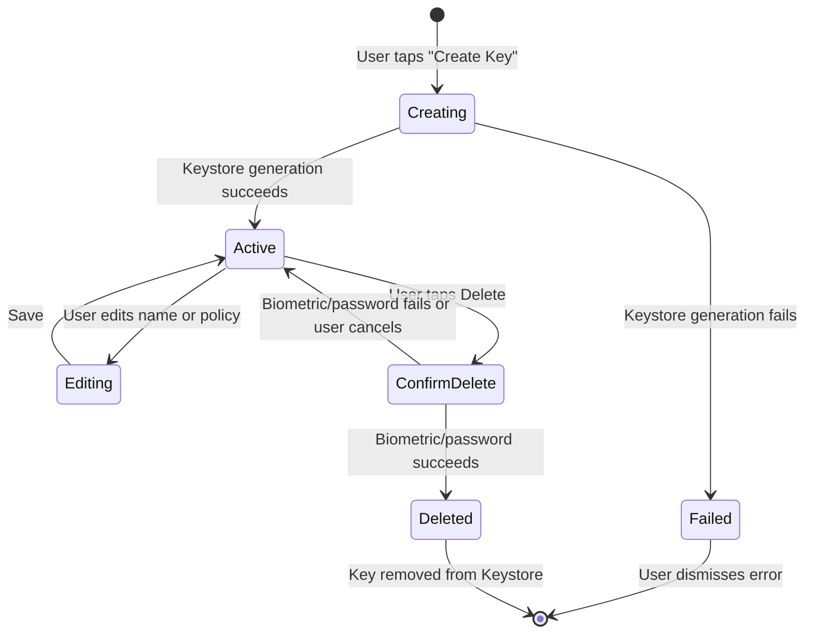
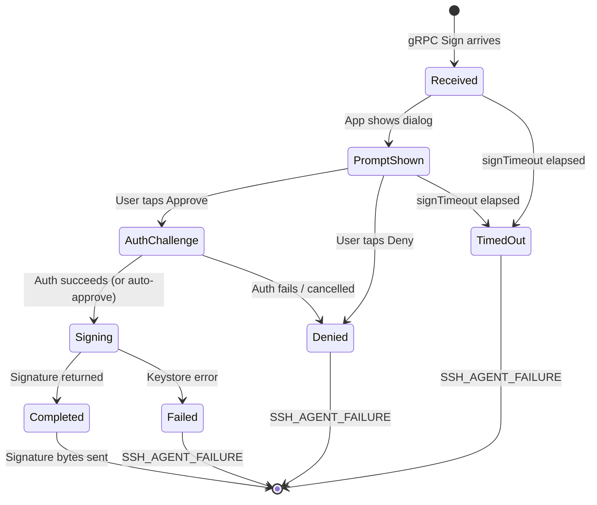
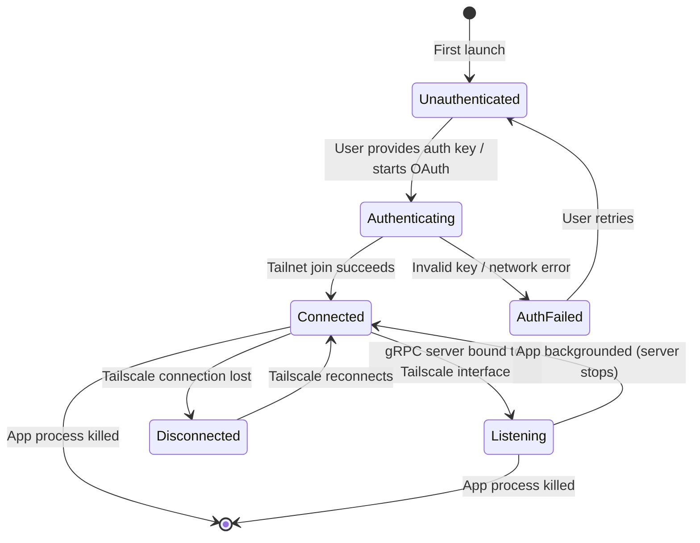
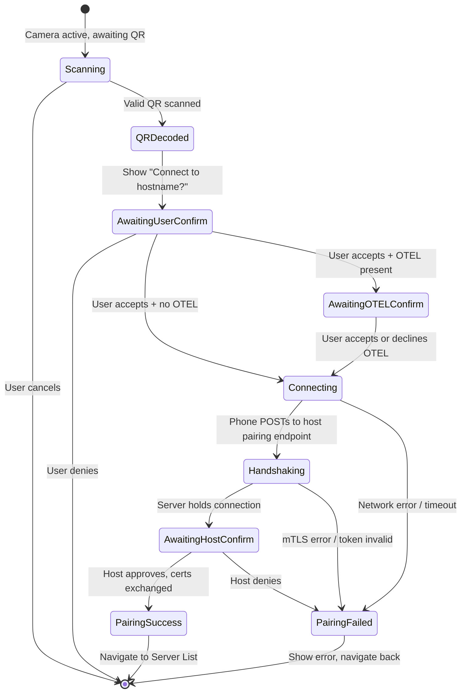

# UI Flow Specification: nix-key Android App

**Created**: 2026-03-28
**Status**: Draft
**Architecture**: Single-activity, Jetpack Compose Navigation

---

## Navigation Flowchart

```mermaid
flowchart TD
    classDef android fill:#2e7d32,stroke:#1b5e20,color:#fff

    LAUNCH([App Launch]):::android
    TS_AUTH[Tailscale Auth Screen]:::android
    SERVER_LIST[Server List / Home]:::android
    PAIRING[Pairing Screen]:::android
    KEY_MGMT[Key Management Screen]:::android
    KEY_DETAIL[Key Detail Screen]:::android
    SETTINGS[Settings Screen]:::android
    SIGN_PROMPT[Sign Request Prompt]:::android

    LAUNCH -->|First launch / no auth| TS_AUTH
    LAUNCH -->|Auth present| SERVER_LIST
    TS_AUTH -->|Auth success| SERVER_LIST
    SERVER_LIST -->|Tap "Scan QR Code"| PAIRING
    SERVER_LIST -->|Tap host row| KEY_MGMT
    SERVER_LIST -->|Tap gear icon| SETTINGS
    PAIRING -->|Pairing complete or cancel| SERVER_LIST
    KEY_MGMT -->|Tap key row| KEY_DETAIL
    KEY_MGMT -->|Tap "Create Key" FAB| KEY_DETAIL
    KEY_MGMT -->|Back| SERVER_LIST
    KEY_DETAIL -->|Back / Save / Delete| KEY_MGMT
    SETTINGS -->|Back| SERVER_LIST
    SIGN_PROMPT -.->|Overlay, any screen| SIGN_PROMPT
```

---

## State Machines

### Key Lifecycle



### Sign Request Lifecycle



### Tailscale Connection State



### Pairing Session State



---

## Screen-by-Screen Details

### 1. Tailscale Auth Screen (First Launch)

**Route**: `tailscale_auth`

**Purpose**: Authenticate with Tailscale to join the Tailnet. Shown once on first launch or when auth state is lost.

**Layout**:
- App logo and name
- Text field: Tailscale auth key (paste-friendly, monospace)
- OR divider
- "Sign in with Tailscale" button (OAuth flow, opens browser)
- Progress indicator during Tailnet join
- Success: auto-navigate to Server List
- Failure: inline error with retry option

**User Actions**:
| Action | Result |
|--------|--------|
| Paste auth key + tap "Connect" | Validates key format, starts Tailnet join |
| Tap "Sign in with Tailscale" | Opens system browser for OAuth, returns via deep link |
| Tap "Back" (system) | Exits app (no bypass allowed) |

**Field Validations**: See Field Validation Reference Table.

**Navigation**: On success, navigate to `server_list` and clear back stack.

**Related FRs**: FR-013a

---

### 2. Server List (Home Screen)

**Route**: `server_list`

**Purpose**: Display all paired hosts with connection status. Primary entry point after auth.

**Layout**:
- Top bar: "nix-key" title, gear icon (Settings)
- List of paired hosts, each row:
  - Host name (e.g., "workstation")
  - Tailscale IP (e.g., "100.64.0.1")
  - Connection status dot: green (reachable), red (unreachable), grey (unknown/stale)
- Empty state: illustration + "No paired hosts yet. Scan a QR code to pair."
- Bottom: "Scan QR Code" button (full-width, prominent)

**User Actions**:
| Action | Result |
|--------|--------|
| Tap host row | Navigate to Key Management for that host |
| Tap "Scan QR Code" | Navigate to Pairing Screen |
| Tap gear icon | Navigate to Settings |
| Pull to refresh | Re-ping all hosts, update status dots |

**Navigation**:
- `server_list` -> `pairing`
- `server_list` -> `key_management/{hostId}`
- `server_list` -> `settings`

**Related FRs**: FR-029, FR-030

---

### 3. Pairing Screen

**Route**: `pairing`

**Purpose**: Scan a QR code from `nix-key pair` on the host and complete the mTLS pairing handshake.

**Layout**:
- Full-screen camera viewfinder with QR detection overlay
- "Cancel" button (top-left)
- After QR scan, camera pauses and a bottom sheet appears:
  - Host name and Tailscale IP from QR
  - "Connect to {hostname}?" prompt
  - Accept / Deny buttons
- If OTEL endpoint present in QR, a second prompt follows:
  - "Enable tracing? Traces will be sent to {endpoint}"
  - Accept / Deny (pairing proceeds regardless of choice)
- Progress indicator during mTLS handshake (after user accepts)
- Result screen: success (checkmark + host name) or failure (error message + reason)

**User Actions**:
| Action | Result |
|--------|--------|
| Point camera at QR | QR decoded, bottom sheet appears |
| Tap Accept (pairing) | Proceed to OTEL prompt (if applicable) or start handshake |
| Tap Deny (pairing) | Abort, navigate back to Server List |
| Tap Accept/Deny (OTEL) | Store OTEL preference, start handshake |
| Tap "Done" on result | Navigate to Server List |
| Tap Cancel | Navigate back to Server List |

**QR Code Payload** (decoded JSON):
```json
{
  "hostIp": "100.64.0.1",
  "port": 49152,
  "serverCert": "<PEM-encoded host server cert>",
  "token": "<one-time token>",
  "otelEndpoint": "100.64.0.1:4317"
}
```

**Phone POST body** (to `https://{hostIp}:{port}/pair`):
```json
{
  "phoneName": "Pixel 8",
  "phoneTailscaleIp": "100.64.0.2",
  "phoneListenPort": 29418,
  "phoneServerCert": "<PEM-encoded phone server cert>",
  "oneTimeToken": "<token from QR>"
}
```

**Host response** (after CLI user confirms):
```json
{
  "hostName": "workstation",
  "hostClientCert": "<PEM-encoded host client cert>",
  "status": "approved"
}
```

**Field Validations**: See Field Validation Reference Table.

**Navigation**: On completion (success or failure -> Done), navigate to `server_list`.

**Related FRs**: FR-020 through FR-031

---

### 4. Key Management Screen

**Route**: `key_management/{hostId}`

**Purpose**: List SSH keys on this phone. Keys are global (not per-host), but accessed via host context.

**Layout**:
- Top bar: host name, back arrow
- List of SSH keys, each row:
  - Key name (e.g., "github-signing")
  - Key type badge: "Ed25519" or "ECDSA-P256"
  - Fingerprint (truncated, e.g., "SHA256:abc123...")
  - Created date
- Empty state: "No keys yet. Create one to get started."
- FAB (bottom-right): "+" icon (Create Key)

**User Actions**:
| Action | Result |
|--------|--------|
| Tap key row | Navigate to Key Detail |
| Tap FAB | Navigate to Key Detail in create mode |
| Tap back arrow | Navigate to Server List |

**Navigation**:
- `key_management/{hostId}` -> `key_detail/{keyId}`
- `key_management/{hostId}` -> `key_detail/new`

**Related FRs**: FR-040 through FR-048

---

### 5. Key Detail Screen

**Route**: `key_detail/{keyId}` or `key_detail/new`

**Purpose**: View/edit key properties, manage confirmation policy, export public key, or create a new key.

**Layout (create mode)**:
- Top bar: "Create Key", back arrow
- Key name text field
- Key type selector: Ed25519 (default, chip selected) | ECDSA-P256
- Info text for selected type:
  - Ed25519: "Software-generated, encrypted with Keystore wrapping key"
  - ECDSA-P256: "Hardware-backed via Android Keystore (TEE/StrongBox)"
- Confirmation policy picker (dropdown or segmented):
  - Always ask (default)
  - Biometric only
  - Password only
  - Biometric + Password
  - Auto-approve (shows warning dialog before allowing selection)
- "Create" button

**Layout (view/edit mode)**:
- Top bar: key name, back arrow
- Key name (editable text field)
- Key type (read-only)
- Fingerprint (full SHA256, copyable)
- Created date
- Confirmation policy picker (same as create mode)
- "Export Public Key" section:
  - "Copy to Clipboard" button
  - "Share" button (system share sheet)
  - "Show QR Code" button (displays QR overlay with public key)
- "Delete Key" button (destructive, red) at bottom
- "Save" button (visible when changes pending)

**User Actions**:
| Action | Result |
|--------|--------|
| Edit key name | Enables Save button |
| Change confirmation policy | Enables Save button; auto-approve triggers warning dialog |
| Tap "Create" (create mode) | Generates key in Keystore, navigates to view mode on success |
| Tap "Copy to Clipboard" | Copies public key in SSH format, shows snackbar |
| Tap "Share" | Opens system share sheet with public key text |
| Tap "Show QR Code" | Displays full-screen QR overlay of public key |
| Tap "Delete Key" | Shows biometric/password prompt; on success deletes key, navigates back |
| Tap "Save" | Persists name/policy changes |
| Tap back arrow | Navigate to Key Management (prompt to save if unsaved changes) |

**Auto-Approve Warning Dialog**:
- Title: "Security Warning"
- Body: "Auto-approve allows sign requests to be processed without your confirmation. Any host with a valid mTLS certificate can trigger signing operations silently. Are you sure?"
- Buttons: "Cancel" / "Enable Auto-Approve"

**Field Validations**: See Field Validation Reference Table.

**Navigation**: Back to `key_management/{hostId}`.

**Related FRs**: FR-040 through FR-048

---

### 6. Sign Request Prompt (Overlay Dialog)

**Route**: N/A (overlay dialog, shown on any screen)

**Purpose**: Present incoming sign requests for user approval. Appears as a system-level dialog overlay.

**Layout**:
- Dialog card (centered, modal):
  - Title: "Sign Request"
  - Host name (e.g., "workstation")
  - Key name (e.g., "github-signing")
  - Data hash (truncated SHA256 of data to sign, e.g., "SHA256:ab3f...7c2d")
  - "Approve" button (primary)
  - "Deny" button (secondary)
- If multiple requests pending, each is a separate dialog. Dialogs queue: current dialog must be resolved before next appears.

**User Actions**:
| Action | Result |
|--------|--------|
| Tap "Approve" | Triggers auth challenge per key policy, then signs |
| Tap "Deny" | Returns SSH_AGENT_FAILURE immediately |
| Auth succeeds (biometric/password) | Keystore signs data, returns signature via gRPC |
| Auth fails | Returns SSH_AGENT_FAILURE |
| No response within signTimeout | Dialog auto-dismissed, returns SSH_AGENT_FAILURE |

**Behavior Notes**:
- For auto-approve keys, no dialog is shown. Signing happens immediately in the background.
- For "always ask" keys, the dialog appears but no biometric/password challenge follows the Approve tap.
- Concurrent requests are serialized as individual dialogs in arrival order.

**Related FRs**: FR-050 through FR-053

---

### 7. Settings Screen

**Route**: `settings`

**Purpose**: App-wide configuration.

**Layout**:
- Top bar: "Settings", back arrow
- **Security** section:
  - "Allow key listing" toggle (default: on). When off, phone returns empty list to all ListKeys requests regardless of host config.
  - "Default confirmation policy" picker (for newly created keys)
- **Tracing** section:
  - "Enable tracing" toggle
  - OTEL endpoint text field (visible when tracing enabled, pre-filled from pairing if available)
- **Tailscale** section:
  - Current Tailscale IP (read-only)
  - Tailnet name (read-only)
  - "Re-authenticate" button (re-triggers auth flow)
- **About** section:
  - App version
  - Build info
  - Open source licenses link

**User Actions**:
| Action | Result |
|--------|--------|
| Toggle "Allow key listing" | Immediately effective; persisted |
| Change default confirmation policy | Applied to future keys only |
| Toggle tracing | Enables/disables OTEL export |
| Edit OTEL endpoint | Validated on blur, persisted |
| Tap "Re-authenticate" | Navigate to Tailscale Auth Screen |
| Tap back arrow | Navigate to Server List |

**Field Validations**: See Field Validation Reference Table.

**Navigation**: Back to `server_list`.

**Related FRs**: FR-054, FR-081, FR-086, FR-088

---

## gRPC Endpoint Summary (Phone is Server)

The phone runs a gRPC server over mTLS, bound to the Tailscale interface. The host daemon connects as client.

| RPC | Request | Response | Description |
|-----|---------|----------|-------------|
| `ListKeys` | Empty | `ListKeysResponse { repeated KeyEntry keys }` where `KeyEntry { bytes public_key_blob, string key_type, string display_name, string fingerprint }` | Returns all SSH public keys on the phone. Returns empty list if phone-side "Allow key listing" is off. |
| `Sign` | `SignRequest { string key_fingerprint, bytes data, string trace_parent }` | `SignResponse { bytes signature }` or gRPC error | Signs data with the specified key after user approval per key policy. Returns `PERMISSION_DENIED` on deny/timeout, `NOT_FOUND` if key does not exist, `INTERNAL` on Keystore error. |
| `Ping` | Empty | `PingResponse { int64 timestamp_ms }` | Health check. Returns server timestamp. Used by `nix-key test`. |

**gRPC Metadata**: `traceparent` header propagated per W3C spec when tracing is enabled (FR-018, FR-082).

---

## Pairing HTTP Endpoint (Phone POSTs to Host)

During pairing only, the host runs a temporary HTTPS server. The phone is the HTTP client.

| Method | Path | Request Body | Response Body | Notes |
|--------|------|-------------|---------------|-------|
| `POST` | `/pair` | `{ phoneName, phoneTailscaleIp, phoneListenPort, phoneServerCert, oneTimeToken }` | `{ hostName, hostClientCert, status }` | Connection held open until host CLI user confirms. `status` is `"approved"` or `"denied"`. Token invalidated after use. |

**TLS**: Phone validates host server cert against the full cert from the QR code (pinned, not CA-based). Phone presents no client cert during pairing (one-time token authenticates instead).

---

## Field Validation Reference Table

| Screen | Field | Validation Rules | Error Message |
|--------|-------|-----------------|---------------|
| Tailscale Auth | Auth key | Non-empty; starts with `tskey-auth-` or `tskey-` prefix; no whitespace | "Invalid auth key format" |
| Key Detail | Key name | 1-64 characters; alphanumeric, hyphens, underscores only; unique across all keys | "Name must be 1-64 characters (letters, numbers, hyphens, underscores)" / "A key with this name already exists" |
| Key Detail | Key type | Must be one of: `Ed25519`, `ECDSA-P256` | N/A (selection-based, cannot enter invalid) |
| Key Detail | Confirmation policy | Must be one of: `always_ask`, `biometric`, `password`, `biometric_password`, `auto_approve` | N/A (selection-based, cannot enter invalid) |
| Settings | OTEL endpoint | Valid `host:port` format; host is IP or hostname; port 1-65535 | "Invalid endpoint format (expected host:port)" |
| Pairing | QR payload | Must contain `hostIp`, `port`, `serverCert`, `token`; `hostIp` must be valid Tailscale IP (100.x.x.x range); `port` must be 1-65535; `serverCert` must be valid PEM; `token` must be non-empty | "Invalid QR code" / "Not a nix-key pairing code" |
| Pairing | OTEL endpoint (from QR) | Same as Settings OTEL endpoint | Silently ignored if invalid (pairing still proceeds) |

---

## Compose Navigation Routes

```
NavHost(startDestination = "server_list") {
    composable("tailscale_auth")          // Tailscale Auth Screen
    composable("server_list")             // Server List (Home)
    composable("pairing")                 // Pairing Screen
    composable("key_management/{hostId}") // Key Management
    composable("key_detail/{keyId}")      // Key Detail (view/edit)
    composable("key_detail/new")          // Key Detail (create)
    composable("settings")               // Settings
    // Sign Request Prompt is a Dialog composable, not a navigation destination
}
```

**Start destination logic**: If Tailscale auth state is absent, redirect to `tailscale_auth` before showing `server_list`. Implemented via a splash/loading check, not a conditional start destination.
