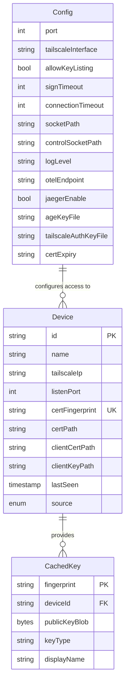
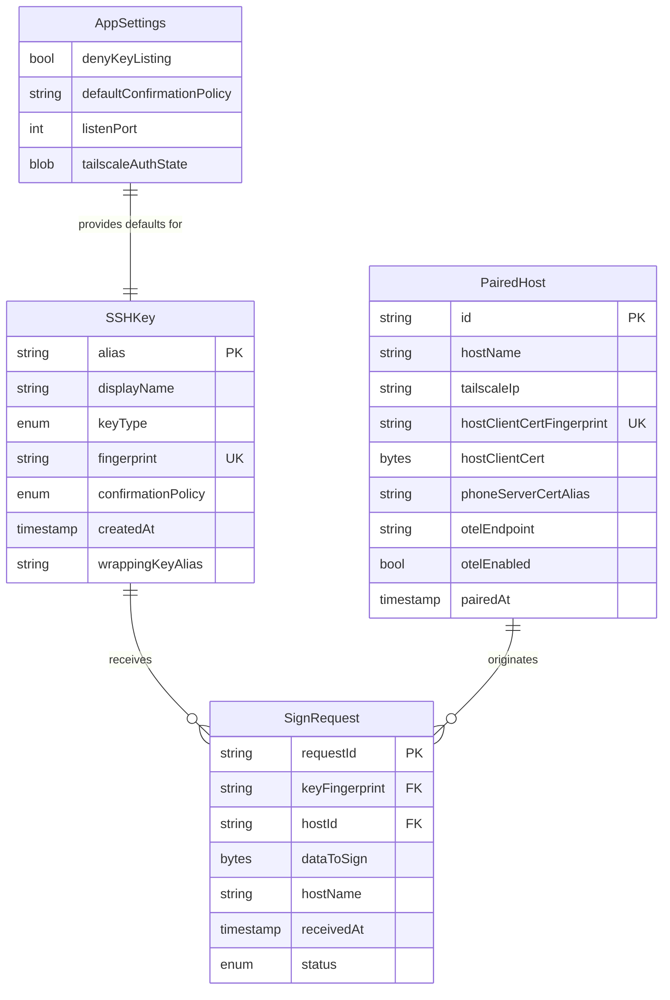
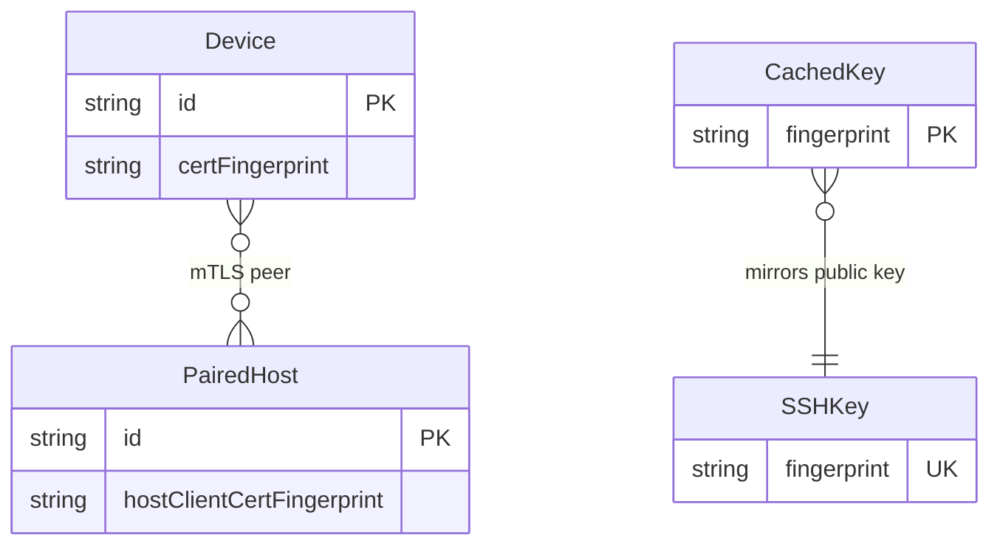

# Data Model -- nix-key

**Parent spec**: [spec.md](./spec.md)
**Created**: 2026-03-28
**Status**: Draft

---

## Entity Relationship Diagram

### Host Side (Go daemon)



### Android Side (Kotlin)



### Cross-Side Relationships



`Device.certFingerprint` on the host matches `PairedHost.phoneServerCertAlias` cert on the phone. `PairedHost.hostClientCertFingerprint` on the phone matches the cert at `Device.clientCertPath` on the host. These are established during pairing and pinned for all subsequent mTLS connections.

---

## Field Tables

### Host Side

#### Device

| Field | Type | Constraints | Default | Description |
|-------|------|-------------|---------|-------------|
| `id` | `string` | **PK**, derived from `certFingerprint` | -- | Unique device identifier, deterministically derived from the phone's server cert SHA256 fingerprint |
| `name` | `string` | Required, non-empty | -- | Phone display name (e.g. "Pixel 8"), set by phone during pairing |
| `tailscaleIp` | `string` | Required, valid IPv4 | -- | Phone's Tailscale IP. Updated on successful reconnect if changed (FR-E12) |
| `listenPort` | `int` | Required, 1--65535 | `29418` | Port the phone's gRPC server listens on |
| `certFingerprint` | `string` | **Unique**, SHA256 hex | -- | SHA256 fingerprint of the phone's TLS server certificate. Primary identity for cert pinning |
| `certPath` | `string` | Required, valid path | -- | Path to stored phone server cert (PEM), age-encrypted on disk |
| `clientCertPath` | `string` | Required, valid path | -- | Path to host's client cert for this device (PEM). Used during mTLS with this phone |
| `clientKeyPath` | `string` | Required, valid path | -- | Path to host's client private key for this device (PEM), age-encrypted on disk |
| `lastSeen` | `timestamp` | Nullable, ISO 8601 | `null` | Last successful connection timestamp. `null` if never connected (nix-declared, not yet reached) |
| `source` | `enum` | `"nix-declared"` or `"runtime-paired"` | -- | How this device was added. Nix-declared devices come from NixOS module config; runtime-paired from `nix-key pair` |

**Storage**: Runtime-paired devices in `~/.local/state/nix-key/devices.json`. Nix-declared devices from `~/.config/nix-key/config.json` (generated by NixOS module). Merged at daemon startup (FR-064).

**Merge rule**: If a device `id` exists in both sources, the nix-declared version wins for `clientCertPath`/`clientKeyPath` (if set), runtime version wins for `lastSeen` and `tailscaleIp`.

#### Config

| Field | Type | Constraints | Default | Description |
|-------|------|-------------|---------|-------------|
| `port` | `int` | 1--65535 | `29418` | Default port for phone connections (overridden per-device by `Device.listenPort`) |
| `tailscaleInterface` | `string` | Required, non-empty | `"tailscale0"` | Network interface name for Tailscale |
| `allowKeyListing` | `bool` | -- | `true` | Whether the host allows listing keys. If `false`, empty list returned without contacting phones (FR-005) |
| `signTimeout` | `int` | >= 1 | `30` | Seconds to wait for user to approve/deny a sign request on the phone |
| `connectionTimeout` | `int` | >= 1 | `10` | Seconds to wait for mTLS connection to a phone |
| `socketPath` | `string` | Required, valid path | `"$XDG_RUNTIME_DIR/nix-key/agent.sock"` | Unix socket path for SSH agent protocol |
| `controlSocketPath` | `string` | Required, valid path | -- | Unix socket for CLI-to-daemon control commands |
| `logLevel` | `string` | One of `"debug"`, `"info"`, `"warn"`, `"error"`, `"fatal"` | `"info"` | Minimum log level |
| `otelEndpoint` | `string` or `null` | Valid URL or null | `null` | OTLP collector endpoint. `null` disables tracing (FR-086) |
| `jaegerEnable` | `bool` | -- | `false` | Whether the NixOS module should run a Jaeger instance |
| `ageKeyFile` | `string` | Required, valid path | `"~/.local/state/nix-key/age-identity.txt"` | Path to age identity file for decrypting mTLS private keys |
| `tailscaleAuthKeyFile` | `string` or `null` | Valid path or null | `null` | Path to Tailscale pre-authorized key file (for automated setups) |
| `certExpiry` | `string` | Duration format (e.g. `"365d"`) | `"365d"` | Expiry duration for generated mTLS certificates |

**Storage**: `~/.config/nix-key/config.json`, generated by NixOS module (FR-062). Read-only at runtime. Validated on daemon startup (FR-100).

#### CachedKey (in-memory)

| Field | Type | Constraints | Default | Description |
|-------|------|-------------|---------|-------------|
| `fingerprint` | `string` | **PK**, SHA256 hex | -- | SSH public key fingerprint |
| `deviceId` | `string` | **FK** -> `Device.id` | -- | Which device owns this key |
| `publicKeyBlob` | `bytes` | Required | -- | Raw SSH public key blob (for agent protocol responses) |
| `keyType` | `string` | `"ssh-ed25519"` or `"ecdsa-sha2-nistp256"` | -- | SSH key type string |
| `displayName` | `string` | Required | -- | Human-readable key name from the phone |

**Storage**: In-memory only. Populated by `ListKeys` gRPC call to each reachable device. Invalidated when: a device is added/removed/revoked, `connectionTimeout` elapses since last refresh, or daemon restarts.

---

### Android Side

#### SSHKey

| Field | Type | Constraints | Default | Description |
|-------|------|-------------|---------|-------------|
| `alias` | `string` | **PK**, unique Keystore alias | -- | Android Keystore alias. For ECDSA: the key pair alias. For Ed25519: the software key identifier |
| `displayName` | `string` | Required, non-empty, user-editable | -- | User-chosen name for the key (FR-048) |
| `keyType` | `enum` | `"ed25519"` or `"ecdsa-p256"` | `"ed25519"` | Key algorithm. Determines storage strategy |
| `fingerprint` | `string` | **Unique**, SHA256 hex | -- | SSH public key fingerprint, computed at creation |
| `confirmationPolicy` | `enum` | See Confirmation Policies below | `"always_ask"` | Per-key confirmation behavior for sign requests (FR-045) |
| `createdAt` | `timestamp` | Required, ISO 8601 | -- | Key creation time |
| `wrappingKeyAlias` | `string` or `null` | Keystore alias, required for Ed25519, null for ECDSA | `null` | Keystore AES key alias used to wrap Ed25519 software key (FR-040) |

**Confirmation policies**: `"always_ask"` (default, shows prompt every time), `"biometric"` (BiometricPrompt only), `"password"` (device credential only), `"biometric_password"` (BiometricPrompt with fallback to device credential), `"auto_approve"` (no prompt, requires security warning acknowledgment per FR-046).

**Storage**: Private key material in Android Keystore (hardware-backed for ECDSA, AES-wrapped for Ed25519). Metadata in EncryptedSharedPreferences. Private keys are never extractable (FR-042).

#### PairedHost

| Field | Type | Constraints | Default | Description |
|-------|------|-------------|---------|-------------|
| `id` | `string` | **PK** | -- | Host identifier |
| `hostName` | `string` | Required, non-empty | -- | Host machine name, received during pairing |
| `tailscaleIp` | `string` | Required, valid IPv4 | -- | Host's Tailscale IP, from QR code |
| `hostClientCertFingerprint` | `string` | **Unique**, SHA256 hex | -- | Pinned fingerprint of the host's client cert. Used to verify mTLS connections |
| `hostClientCert` | `bytes` | Required | -- | Full host client certificate, stored in Android Keystore |
| `phoneServerCertAlias` | `string` | Required, Keystore alias | -- | Keystore alias for the TLS server cert/key pair used when this host connects |
| `otelEndpoint` | `string` or `null` | Valid URL or null | `null` | OTEL collector endpoint received during pairing |
| `otelEnabled` | `bool` | -- | `false` | Whether the user accepted OTEL for this host (FR-088) |
| `pairedAt` | `timestamp` | Required, ISO 8601 | -- | When pairing completed |

**Storage**: EncryptedSharedPreferences for metadata. Host client cert stored in Android Keystore. Phone's per-host server cert/key in Android Keystore under `phoneServerCertAlias`.

#### AppSettings

| Field | Type | Constraints | Default | Description |
|-------|------|-------------|---------|-------------|
| `denyKeyListing` | `bool` | -- | `false` | Phone-side override: if `true`, returns empty key list to all hosts regardless of host config (FR-054) |
| `defaultConfirmationPolicy` | `string` | Valid confirmation policy enum | `"always_ask"` | Default policy applied to newly created keys |
| `listenPort` | `int` | 1--65535 | `29418` | Port for the phone's gRPC TLS server |
| `tailscaleAuthState` | `blob` | Encrypted | -- | Persisted Tailscale auth state so re-auth is not required on every app open (FR-013a) |

**Storage**: EncryptedSharedPreferences.

#### SignRequest (transient, in-memory)

| Field | Type | Constraints | Default | Description |
|-------|------|-------------|---------|-------------|
| `requestId` | `string` | **PK**, UUID | -- | Unique request identifier, generated on receipt |
| `keyFingerprint` | `string` | **FK** -> `SSHKey.fingerprint` | -- | Which key is being asked to sign |
| `hostId` | `string` | **FK** -> `PairedHost.id` | -- | Which host sent the request (identified via mTLS client cert) |
| `dataToSign` | `bytes` | Required | -- | Raw data to be signed |
| `hostName` | `string` | Required | -- | Host name, displayed in the confirmation prompt |
| `receivedAt` | `timestamp` | Required | -- | When the request was received |
| `status` | `enum` | `"pending"`, `"approved"`, `"denied"`, `"timeout"` | `"pending"` | Current request state |

**Storage**: In-memory only. Queued and shown as separate confirmation prompts (FR-053). Lost on app termination (FR-E07).

---

## State Transitions

### Device (Host Side)

```
                          nix-key pair completes
                          or Nix rebuild
                    ┌──────────────────────────┐
                    │                          │
                    v                          │
               ┌─────────┐                    │
               │ PAIRING │ ── mutual confirm ──┘
               └─────────┘   (both sides)
                    │
                    │ success
                    v
               ┌──────────┐   successful    ┌──────────┐
               │  ACTIVE  │ ──connection──> │  ACTIVE  │ (lastSeen updated)
               └──────────┘                 └──────────┘
                    │                            │
                    │ nix-key revoke              │ nix-key revoke
                    v                            v
               ┌──────────┐
               │ REVOKED  │ ── cert deleted, device removed
               └──────────┘
```

| From | To | Trigger | Side Effects |
|------|----|---------|--------------|
| -- | PAIRING | `nix-key pair` started or nix-declared device added | Temp HTTPS server starts (pairing), or device entry created (nix-declared) |
| PAIRING | ACTIVE | Mutual confirmation completes | Certs stored (age-encrypted), device written to `devices.json`, CachedKeys invalidated |
| PAIRING | (removed) | Either side denies, timeout, or token replay | No state persisted on either side (FR-E10) |
| ACTIVE | ACTIVE | Successful connection | `lastSeen` and `tailscaleIp` updated (FR-E12) |
| ACTIVE | REVOKED | `nix-key revoke <device>` | Cert files deleted, device removed from `devices.json`, CachedKeys invalidated (FR-072) |

Note: There is no stored "revoked" state. Revocation deletes the device entirely. A revoked device attempting to connect is rejected because its cert fingerprint is no longer in the authorized list (FR-E09).

### SSHKey (Android Side)

```
    User taps "Create Key"
              │
              v
         ┌──────────┐
         │ CREATED  │ ── immediately ──> ┌──────────┐
         └──────────┘                    │  ACTIVE  │
                                         └──────────┘
                                              │
                                              │ User deletes
                                              │ (biometric/password required)
                                              v
                                         ┌──────────┐
                                         │ DELETED  │
                                         └──────────┘
```

| From | To | Trigger | Side Effects |
|------|----|---------|--------------|
| -- | ACTIVE | User creates key | Key generated in Keystore (ECDSA) or software + AES wrap (Ed25519). Metadata written to EncryptedSharedPreferences |
| ACTIVE | ACTIVE | User edits display name or confirmation policy | Metadata updated in EncryptedSharedPreferences |
| ACTIVE | DELETED | User deletes key (requires biometric/password per FR-047) | Key removed from Keystore, metadata removed from EncryptedSharedPreferences, wrapping key removed (Ed25519). Hosts see updated key list on next `ListKeys` |

Note: There is no "disabled" state. Keys are either active or deleted. The confirmation policy on each key controls whether signing requires interaction.

### SignRequest (Android Side, transient)

```
    gRPC Sign request arrives
              │
              v
         ┌──────────┐
         │ PENDING  │
         └──────────┘
           │   │   │
    ┌──────┘   │   └───────┐
    │          │           │
    v          v           v
┌──────────┐ ┌──────────┐ ┌──────────┐
│ APPROVED │ │  DENIED  │ │ TIMEOUT  │
└──────────┘ └──────────┘ └──────────┘
```

| From | To | Trigger | Side Effects |
|------|----|---------|--------------|
| -- | PENDING | gRPC `Sign` request received from authenticated host | Request queued, confirmation prompt shown (FR-050). For `auto_approve` keys, transitions immediately to APPROVED |
| PENDING | APPROVED | User approves (or auto-approve policy) | Keystore signs data, signature returned via gRPC response |
| PENDING | DENIED | User explicitly denies | gRPC error returned, host daemon sends SSH_AGENT_FAILURE (FR-E02) |
| PENDING | TIMEOUT | `signTimeout` elapses without user action | gRPC error returned, host daemon sends SSH_AGENT_FAILURE (FR-E03) |

All states are terminal. SignRequest objects are discarded after reaching a terminal state.

---

## Cross-Entity Constraints

| Constraint | Description | Enforcement |
|------------|-------------|-------------|
| **C-001**: Device cert uniqueness | No two Devices may share the same `certFingerprint` | Unique constraint on `certFingerprint` in `devices.json`. Pairing rejects duplicate fingerprints |
| **C-002**: Key-device binding | A CachedKey's `deviceId` must reference an existing active Device | CachedKeys invalidated on device removal. Stale entries never served |
| **C-003**: Dual key-listing control | Key list is empty if host `allowKeyListing = false` OR phone `denyKeyListing = true` | Host checks own config first (FR-005); phone checks own setting on `ListKeys` RPC (FR-054) |
| **C-004**: mTLS identity = cert fingerprint | Device identity is `certFingerprint`, not `tailscaleIp`. IP may change; fingerprint is immutable for a given pairing | Host verifies cert fingerprint on every mTLS handshake (FR-011). IP updated transparently (FR-E12) |
| **C-005**: One-time pairing token | A pairing token must not be reusable after any use (success or failure) | Token invalidated server-side immediately after first use (FR-027, FR-E10) |
| **C-006**: Sign request key exists | `SignRequest.keyFingerprint` must reference an active SSHKey on the phone | Phone validates key exists before showing prompt. Returns error if key not found |
| **C-007**: Sign request host authenticated | `SignRequest.hostId` must reference a PairedHost with a pinned cert matching the mTLS client cert | mTLS handshake enforces cert pinning. Unauthenticated requests never reach SignRequest creation |
| **C-008**: Age encryption for host secrets | `Device.clientKeyPath` contents must be age-encrypted on disk | `nix-key pair` encrypts before writing (FR-104). Daemon decrypts into memory at startup (FR-102) |
| **C-009**: Ed25519 wrapping key required | If `SSHKey.keyType = "ed25519"`, then `wrappingKeyAlias` must be non-null and reference a valid Keystore AES key | Enforced at key creation time. ECDSA keys have `wrappingKeyAlias = null` |
| **C-010**: Nix-declared device merge | Nix-declared devices override runtime-paired `clientCertPath`/`clientKeyPath` (if set); runtime-paired wins for `lastSeen` and `tailscaleIp` | Daemon merge logic at startup (FR-064) |
| **C-011**: Cert expiry warning | `nix-key status` must warn when any device cert is within 30 days of expiry | CLI reads cert, computes days remaining (FR-032) |
| **C-012**: Auto-approve requires acknowledgment | `SSHKey.confirmationPolicy` cannot be set to `"auto_approve"` without the user first acknowledging a security warning | Android UI enforces warning dialog before persisting (FR-046) |

---

## Storage Location Summary

| Entity | Side | Storage Location | Encryption | Persistence |
|--------|------|-----------------|------------|-------------|
| **Device** (runtime-paired) | Host | `~/.local/state/nix-key/devices.json` | Plaintext (no secrets in JSON; cert paths reference encrypted files) | Persistent, survives daemon restart |
| **Device** (nix-declared) | Host | `~/.config/nix-key/config.json` | Plaintext (generated by NixOS module) | Persistent, regenerated on `nixos-rebuild` |
| **Device certs** | Host | `~/.local/state/nix-key/certs/` | age-encrypted private keys; plaintext public certs | Persistent |
| **Config** | Host | `~/.config/nix-key/config.json` | Plaintext (no secrets; references `ageKeyFile` path) | Persistent, regenerated on `nixos-rebuild` |
| **Age identity** | Host | `~/.local/state/nix-key/age-identity.txt` | Protected by file permissions (0600) | Persistent |
| **CachedKey** | Host | In-memory | N/A | Transient, lost on daemon restart |
| **SSHKey** (private, ECDSA) | Android | Android Keystore (TEE/StrongBox) | Hardware-backed, non-extractable | Persistent until deleted |
| **SSHKey** (private, Ed25519) | Android | Android Keystore (AES-wrapped) | Software key encrypted by Keystore AES key | Persistent until deleted |
| **SSHKey** (metadata) | Android | EncryptedSharedPreferences | AES-256 via Keystore master key | Persistent until deleted |
| **PairedHost** (metadata) | Android | EncryptedSharedPreferences | AES-256 via Keystore master key | Persistent until unpairing |
| **PairedHost** (host client cert) | Android | Android Keystore | Hardware-backed storage | Persistent until unpairing |
| **PairedHost** (phone server cert/key) | Android | Android Keystore | Hardware-backed storage | Persistent until unpairing |
| **AppSettings** | Android | EncryptedSharedPreferences | AES-256 via Keystore master key | Persistent |
| **SignRequest** | Android | In-memory | N/A | Transient, lost on app termination |
